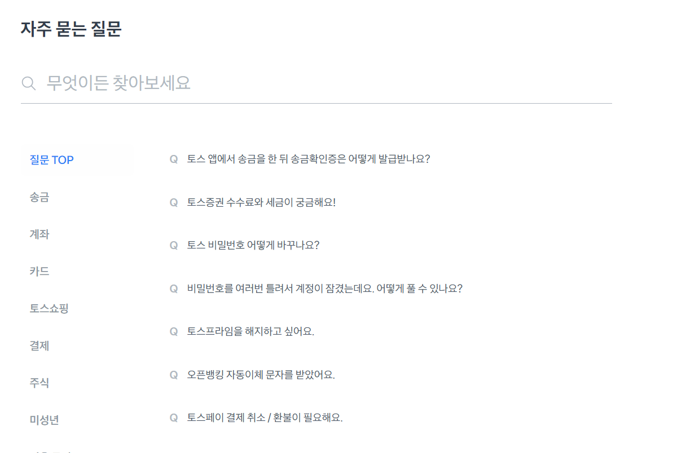
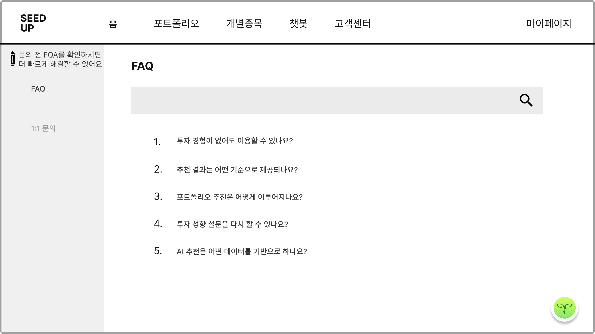
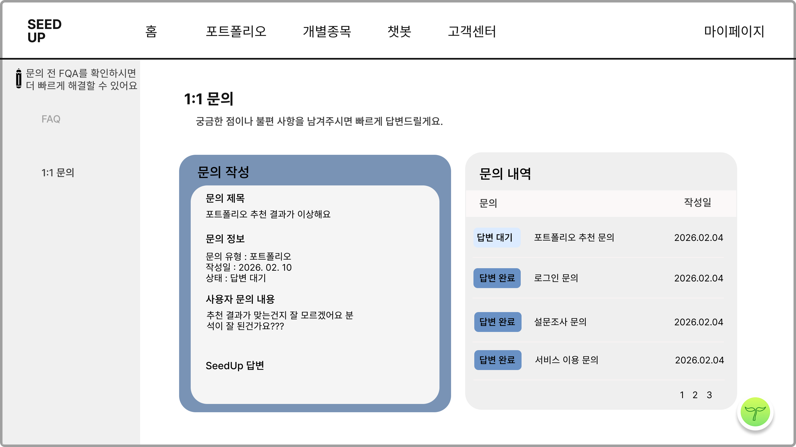

# 고객센터 페이지 구현 프롬프트

아래 요구사항을 바탕으로 **SEED UP 서비스의 고객센터 페이지**를 구현해줘.
기본 베이스는 현재 프로젝트의 **design-system 컴포넌트 / 토큰 / spacing / typography / color system**을 최대한 우선 사용하고, 디테일한 UI 완성도는 첨부한 레퍼런스 이미지를 참고해서 더 세련되고 실제 서비스처럼 보이게 만들어줘.

---

## 1. 작업 목표

고객센터 페이지는 크게 **FAQ 탭**과 **1:1 문의 탭**으로 구성한다.

레퍼런스 이미지 기준으로 전체적인 구조는 다음과 같다.

* 상단: 기존 서비스 공통 헤더 사용
* 좌측: 사이드 메뉴

  * 안내 문구
  * FAQ
  * 1:1 문의
* 우측 메인 영역:

  * FAQ 탭일 때: 검색창 + FAQ 리스트
  * 1:1 문의 탭일 때: 문의 작성/상세 영역 + 문의 내역 리스트
* 우하단: 기존 서비스의 플로팅 버튼이 있다면 유지

단, 단순 복제 말고 **더 정돈되고 완성도 높은 프로덕트 UI**로 개선해줘.

---

## 2. 구현 방향

### 공통 방향

* 기존 프로젝트의 **design-system을 최우선 사용**
* 없는 컴포넌트만 최소한으로 커스텀 스타일 추가
* 반응형 고려

  * desktop 우선
  * tablet에서도 무너지지 않게
  * 모바일에서는 2단 레이아웃을 1단으로 자연스럽게 전환
* 전체적으로 **깔끔하고 신뢰감 있는 금융 서비스 UI** 톤으로 구현
* 과한 장식보다 **정리된 여백 / 명확한 정보 구조 / 좋은 가독성** 중심

### 스타일 방향

* 너무 밋밋한 회색 박스 수준이 아니라, 아래 요소를 활용해 완성도 있게 디자인

  * 카드형 레이아웃
  * 적절한 border / radius / shadow
  * 탭/사이드 메뉴 active 상태 강조
  * 검색창 focus 상태
  * 배지(status) 스타일 차별화
  * hover / selected / empty / loading 상태까지 자연스럽게 고려
* 컬러는 design-system 기준을 따르되,

  * 고객센터 특성상 안정감 있고 친절한 느낌
  * 강조 요소는 브랜드 포인트 컬러 사용
* 타이포그래피는 제목 / 본문 / 보조 텍스트 위계를 분명히 해줘

---

## 3. 페이지 구조

### 전체 레이아웃

* `CustomerCenterPage` 기준으로 구성
* 추천 레이아웃:

  * 좌측 `SideNavigation`
  * 우측 `ContentArea`
* 데스크탑에서는 좌우 2단 구조
* 모바일에서는 사이드 메뉴를 상단 탭 또는 아코디언형 메뉴로 전환 가능

예시 구조:

```tsx
<CustomerCenterPage>
  <CustomerCenterSidebar />
  <CustomerCenterContent />
</CustomerCenterPage>
```

---

## 4. 좌측 사이드 메뉴 요구사항

### 포함 요소

* 상단 안내 문구

  * 예: "문의 전 FAQ를 확인하시면 더 빠르게 해결할 수 있어요"
* 메뉴 항목

  * FAQ
  * 1:1 문의

### 동작

* 클릭 시 우측 컨텐츠 전환
* 현재 선택된 메뉴는 active 처리

### 디자인 가이드

* 단순 텍스트 나열 말고 메뉴 카드/버튼처럼 보이게
* active 상태:

  * 배경 또는 좌측 바 또는 아이콘 강조
* hover 상태 제공
* 상단 안내 박스는 아이콘과 함께 작게 들어가도 좋음

---

## 5. FAQ 탭 요구사항

### 구성 요소

1. 페이지 타이틀

   * `FAQ`
2. 검색창

   * placeholder 예: `궁금한 내용을 검색해보세요`
   * 검색 아이콘 포함
3. FAQ 리스트

   * 기본적으로 질문 목록 표시
   * 클릭 시 아코디언 형태로 답변 열림

### 예시 FAQ 데이터

* 투자 경험이 없어도 이용할 수 있나요?
* 추천 결과는 어떤 기준으로 제공되나요?
* 포트폴리오 추천은 어떻게 이루어지나요?
* 투자 성향 설문을 다시 할 수 있나요?
* AI 추천은 어떤 데이터를 기반으로 하나요?

### FAQ UX 요구사항

* 검색어 입력 시 질문/답변 기준 필터링
* 검색 결과 없을 때 empty state 제공
* 질문 클릭 시 부드럽게 열리고 닫히는 아코디언 적용
* 현재 열린 항목은 강조

### FAQ 디자인 가이드

* 리스트형보다는 **정돈된 accordion card UI**로 구성
* 번호를 꼭 유지하지 않아도 되지만, 필요하면 subtle하게 사용
* 질문은 한눈에 읽히게
* 답변 영역은 배경 톤을 살짝 다르게 해서 구분
* 검색창은 넓고 깔끔하게, 금융 서비스 느낌으로 절제된 스타일

---

## 6. 1:1 문의 탭 요구사항

1:1 문의 탭은 **좌측 문의 상세/작성 카드**와 **우측 문의 내역 리스트**로 구성한다.

### 상단 헤더 영역

* 타이틀: `1:1 문의`
* 설명 문구: `궁금한 점이나 불편 사항을 남겨주시면 빠르게 답변드릴게요.`

---

## 7. 1:1 문의 - 좌측 상세/작성 영역

### 기본 구성

카드 형태로 구현하고, 아래 정보를 포함한다.

* 섹션 제목: `문의 작성` 또는 `문의 상세`
* 문의 제목
* 문의 정보

  * 문의 유형
  * 작성일
  * 상태
* 사용자 문의 내용
* SeedUp 답변

### 상태 케이스

* 답변 대기
* 답변 완료

### 동작 제안

* 우측 문의 내역 리스트에서 항목 클릭 시 좌측 상세 내용 갱신
* 신규 문의 작성 버튼이 있다면 모달 또는 폼으로 확장 가능하게 구조 설계
* 초기 버전에서는 상세 조회 중심으로 구현해도 됨

### 디자인 가이드

* 레퍼런스처럼 큰 카드 구조를 사용하되 더 세련되게 정리
* 내부 텍스트는 정보 블록으로 구분
* `문의 제목`, `문의 정보`, `사용자 문의 내용`, `SeedUp 답변` 섹션의 위계가 명확해야 함
* 답변이 없을 경우 empty state 또는 안내 문구 제공
* 상태값은 badge로 표시

  * 답변 대기: 경고/대기 느낌
  * 답변 완료: 완료/안정 느낌

---

## 8. 1:1 문의 - 우측 문의 내역 리스트

### 구성 요소

* 카드 제목: `문의 내역`
* 컬럼 예시

  * 상태
  * 문의 제목
  * 작성일
* 페이지네이션 또는 더보기

### 예시 데이터

* 포트폴리오 추천 문의 / 2026.02.04 / 답변 대기
* 로그인 문의 / 2026.02.04 / 답변 완료
* 설문조사 문의 / 2026.02.04 / 답변 완료
* 서비스 이용 문의 / 2026.02.04 / 답변 완료

### 동작

* 리스트 항목 클릭 시 선택 상태 표시
* 선택된 항목의 상세 내용이 좌측에 표시
* hover / active 상태 구분

### 디자인 가이드

* 표처럼 딱딱하게만 만들지 말고 카드 안의 리스트 형태로 깔끔하게 구성
* 행 간격 충분히 확보
* 상태 배지는 작지만 눈에 잘 띄게
* 날짜, 상태, 제목의 정보 우선순위가 명확해야 함

---

## 9. 컴포넌트 설계 가이드

가능하면 아래처럼 컴포넌트를 분리해줘.

```tsx
CustomerCenterPage
 ├─ CustomerCenterSidebar
 ├─ CustomerCenterHeader
 ├─ FaqSection
 │   ├─ FaqSearchBar
 │   └─ FaqAccordionList
 └─ InquirySection
     ├─ InquiryDetailCard
     └─ InquiryHistoryList
```

### 추가 권장 컴포넌트

* `StatusBadge`
* `EmptyState`
* `SectionCard`
* `SearchInput`

---

## 10. 상태 관리 가이드

페이지 초기 구현에서는 mock data 기반으로 작성해줘.

예시 상태:

```tsx
const [activeTab, setActiveTab] = useState<'faq' | 'inquiry'>('faq')
const [searchKeyword, setSearchKeyword] = useState('')
const [selectedInquiryId, setSelectedInquiryId] = useState<string | number>()
```

### FAQ

* mock FAQ 배열 정의
* 검색어에 따라 필터링
* 아코디언 open 상태 관리

### 문의 내역

* mock inquiry 배열 정의
* 선택된 문의 상세를 좌측 카드에 표시

---

## 11. 접근성 / 사용성

* 검색 input label 또는 aria-label 제공
* 아코디언 키보드 접근 가능하게
* 선택 상태가 색상에만 의존하지 않도록 처리
* 상태 배지는 텍스트로도 명확히 구분
* 빈 데이터, 로딩 데이터, 에러 상태까지 기본 구조 고려

---

## 12. 구현 시 꼭 반영할 것

* 기존 **design-system 컴포넌트 최대 활용**
* 현재 프로젝트 스타일과 이질감 없게
* 레퍼런스 이미지는 구조 참고용이고, 결과물은 **좀 더 고급스럽고 서비스답게 개선**
* 너무 투박한 박스 UI 금지
* 실제 배포 가능한 수준으로 컴포넌트/레이아웃/상태를 정리

---

## 13. 원하는 결과물

다음 내용을 포함해서 구현해줘.

1. `CustomerCenterPage` 전체 코드
2. 필요한 하위 컴포넌트 코드 분리
3. mock data 예시
4. 스타일 방식

   * 현재 프로젝트 스타일 방식에 맞춰 작성 (`css`, `module.css`, `styled-components`, `tailwind` 등 기존 방식 따르기)
5. 반응형 처리 포함

---

## 14. 참고 레퍼런스 해석

레퍼런스 이미지는 아래 의도를 참고해 반영해줘.

### FAQ 화면 의도

* 좌측에 간단한 메뉴
* 우측에 큰 타이틀과 검색창
* 질문 리스트가 한눈에 보이는 구조

### 1:1 문의 화면 의도

* 좌측은 현재 선택된 문의의 상세 내용 확인
* 우측은 문의 목록 빠르게 탐색
* 상태값이 직관적으로 보이는 구조

단, 그대로 복붙하듯 구현하지 말고 **spacing, alignment, typography, card styling, active state, hover state**를 개선해서 더 세련되게 만들어줘.

---

## 15. 예시 문구 데이터

### FAQ answers 예시

* 투자 경험이 없어도 이용할 수 있나요?
  → 네, 가능합니다. SeedUp은 투자 경험이 많지 않은 사용자도 쉽게 이해할 수 있도록 투자 성향 설문과 추천 결과를 직관적으로 제공합니다.

* 추천 결과는 어떤 기준으로 제공되나요?
  → 사용자의 투자 성향, 목표, 위험 선호도, 입력한 정보 등을 바탕으로 포트폴리오와 종목 추천 결과를 제공합니다.

* 포트폴리오 추천은 어떻게 이루어지나요?
  → 투자 성향 설문 결과와 시장 데이터, 자산 분산 원칙 등을 종합적으로 반영해 포트폴리오 예시를 제공합니다.

* 투자 성향 설문을 다시 할 수 있나요?
  → 네, 마이페이지 또는 관련 설정 화면에서 다시 진행할 수 있도록 설계해주세요.

* AI 추천은 어떤 데이터를 기반으로 하나요?
  → 사용자 입력 정보, 시장 데이터, 종목 특성, 포트폴리오 구성 원칙 등 서비스 정책에 맞는 데이터를 기반으로 제공합니다.

### 1:1 문의 상세 예시

* 제목: 포트폴리오 추천 결과가 이상해요
* 문의 유형: 포트폴리오
* 작성일: 2026.02.10
* 상태: 답변 대기
* 사용자 문의 내용: 추천 결과가 맞는건지 잘 모르겠어요. 분석이 잘 된건가요?
* SeedUp 답변: 답변 대기 중입니다. 확인 후 빠르게 답변드릴게요.

### 참고 페이지



---

## 16. 마무리 요청

최종 결과는 단순한 와이어프레임 말고, **실제 서비스에 넣어도 어색하지 않은 수준의 고객센터 UI**로 만들어줘.
디자인 시스템을 기반으로 일관성 있게 구성하고, 레퍼런스보다 더 보기 좋게 개선해서 구현해줘.
