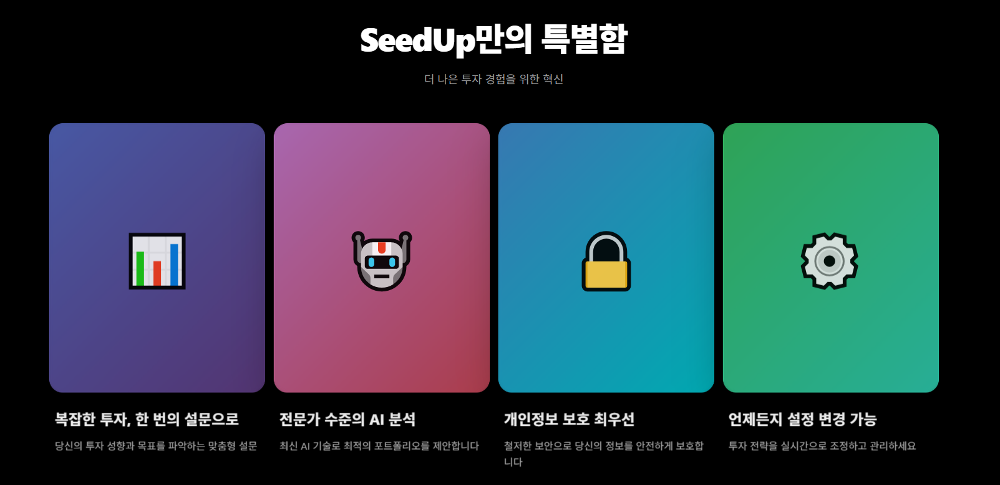

좋아. 그럼 **React(일반 React/Vite/CRA 공통)** 기준으로, **SeedUp 색감(아이보리+옐로우) 유지**하면서 히어로에 **은은한 3D 배경** 얹는 MD를 최종본으로 줄게. (Copilot에 그대로 붙이면 됨)

````md
# SeedUp Hero 3D (React) — Keep Ivory/Yellow Palette

## Goal
Add a **subtle premium 3D background** to the hero section while keeping the current SeedUp vibe:
- Warm ivory background stays
- Soft yellow accent stays
- 3D is “barely moving”, low contrast, premium depth
- Text/CTA readability is priority #1

---

## Install
```bash
npm install three @react-three/fiber @react-three/drei
````

---

## Recommended Palette (tune to your CSS tokens)

```txt
Ivory background: #F7F2E6
Warm ivory alt:   #F6F1E3
Accent yellow:    #F7D84B / #F5D547
Headline text:    #222222
Subtext:          #666666
Border:           #E9E2D3
Soft gold (3D):   #E8C95A (not neon)
```

---

## File Structure

```txt
src/
  components/
    Hero/
      Hero.jsx
      Hero3D.jsx
      hero.css
```

---

## Hero.jsx

Place 3D behind the content.

```jsx
import "./hero.css"
import Hero3D from "./Hero3D"

export default function Hero() {
  return (
    <section className="hero">
      <Hero3D />

      <div className="hero-content">
        <h1>나에게 맞는 투자 설계</h1>
        <p>개인의 금융 목표와 성향에 맞춘 맞춤형 투자 설계 서비스</p>

        <div className="hero-actions">
          <button className="btn-primary">회원가입하기</button>
          <button className="btn-outline">이미 계정이 있으신가요? 로그인</button>
        </div>
      </div>
    </section>
  )
}
```

---

## hero.css

Keep SeedUp’s warm background and add a subtle overlay to “polish” the 3D.

```css
.hero {
  position: relative;
  height: 100vh;
  overflow: hidden;
  background: #F7F2E6; /* keep ivory */
}

/* optional premium polish: very subtle vignette */
.hero::before {
  content: "";
  position: absolute;
  inset: 0;
  z-index: 1;
  pointer-events: none;
  background: radial-gradient(
    circle at 50% 35%,
    rgba(255, 255, 255, 0.00) 0%,
    rgba(246, 241, 227, 0.45) 60%,
    rgba(246, 241, 227, 0.70) 100%
  );
}

.hero-content {
  position: relative;
  z-index: 2;
  height: 100%;
  display: grid;
  place-items: center;
  text-align: center;
  color: #222;
  padding: 24px;
}

.hero-actions {
  display: flex;
  gap: 12px;
  margin-top: 20px;
  justify-content: center;
  flex-wrap: wrap;
}

.btn-primary {
  background: #F7D84B;
  border: 1px solid #F7D84B;
  padding: 12px 18px;
  border-radius: 10px;
  color: #222;
  font-weight: 600;
}

.btn-outline {
  background: transparent;
  border: 1px solid #E9E2D3;
  padding: 12px 18px;
  border-radius: 10px;
  color: #222;
  font-weight: 500;
}

/* 3D layer */
.hero-3d {
  position: absolute;
  inset: 0;
  z-index: 0; /* stays behind overlay + text */
  pointer-events: none;
}
```

---

## Hero3D.jsx (Subtle Warm 3D)

Key rules:

* **low contrast**
* **slow motion**
* avoid center-lower area (CTA zone)
* small number of objects (2–3)

```jsx
import { Canvas } from "@react-three/fiber"
import { Float } from "@react-three/drei"

function GoldRing() {
  return (
    <Float speed={0.75} rotationIntensity={0.12} floatIntensity={0.22}>
      {/* Move it slightly away from center/CTA */}
      <mesh position={[1.4, 0.6, -0.2]} rotation={[0.2, 0.4, 0]}>
        <torusGeometry args={[1.35, 0.055, 24, 140]} />
        <meshStandardMaterial
          color="#E8C95A"
          metalness={0.65}
          roughness={0.38}
        />
      </mesh>
    </Float>
  )
}

function IvoryPanel({ position, rotation, opacity = 0.22 }) {
  return (
    <Float speed={0.6} rotationIntensity={0.08} floatIntensity={0.18}>
      <mesh position={position} rotation={rotation}>
        <planeGeometry args={[1.9, 1.25]} />
        <meshStandardMaterial
          color="#F7F2E6"
          transparent
          opacity={opacity}
          roughness={0.18}
          metalness={0.05}
        />
      </mesh>
    </Float>
  )
}

export default function Hero3D() {
  return (
    <div className="hero-3d" aria-hidden="true">
      <Canvas camera={{ position: [0, 0, 5], fov: 50 }} dpr={[1, 1.5]}>
        {/* Warm, soft lighting */}
        <ambientLight intensity={0.85} />

        <directionalLight position={[3, 3, 2]} intensity={0.55} />
        <directionalLight position={[-3, -2, 2]} intensity={0.25} />

        {/* Objects (keep minimal) */}
        <GoldRing />
        <IvoryPanel position={[-1.6, 0.2, -0.9]} rotation={[0, 0.25, 0]} />
        <IvoryPanel position={[0.9, -1.1, -1.1]} rotation={[0, -0.2, 0]} opacity={0.18} />
      </Canvas>
    </div>
  )
}
```

---

## Tuning Checklist (to keep it “premium”)

If it competes with text:

* reduce ring `metalness` (0.65 → 0.45)
* increase ring `roughness` (0.38 → 0.55)
* reduce panel `opacity` (0.22 → 0.14)
* move objects further back on Z (e.g. `-1.2` → `-1.6`)
* keep motion small:

  * `rotationIntensity <= 0.15`
  * `floatIntensity <= 0.25`

---

## Performance Notes

* Keep meshes <= 3
* No particle systems
* `dpr` capped at 1.5
* `pointer-events: none` on the canvas wrapper

```


```
1번
복잡한 투자, 한 번의 설문으로
당신의 투자 성향과 목표를 파악하는 맞춤형 설문

2번
전문가 수준의 AI 분석
최신 AI 기술로 최적의 포트폴리오를 제안합니다

3번
개인정보 보호 최우선
철저한 보안으로 당신의 정보를 안전하게 보호합니다

4번
언제든지 설정 변경 가능
투자 전략을 실시간으로 조정하고 관리하세요



```