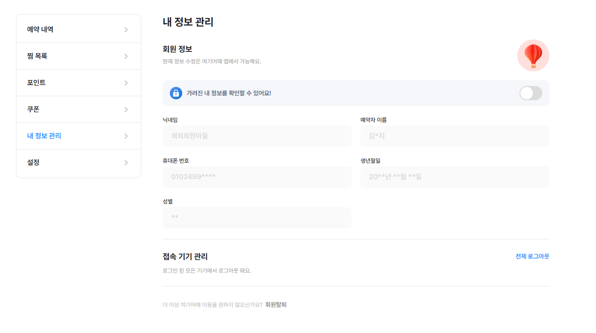
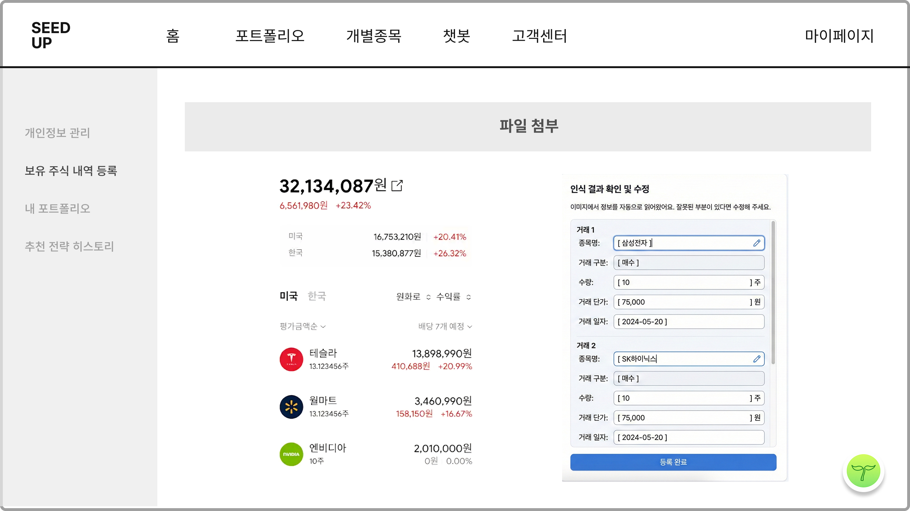
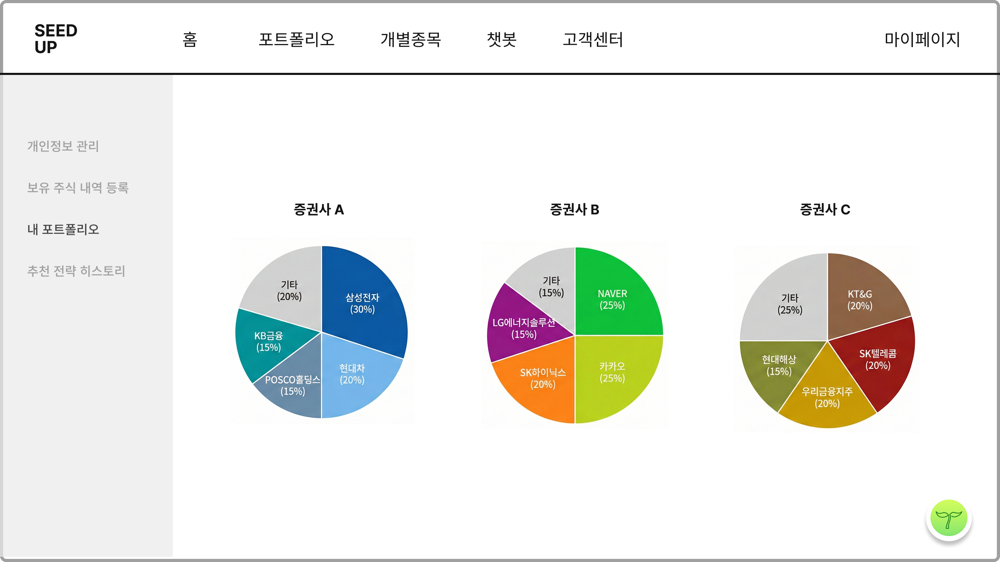
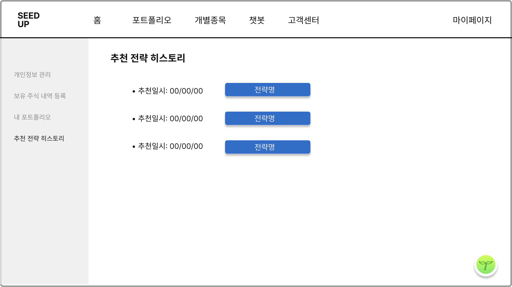

# MyPage 페이지 구현 프롬프트

## 역할

당신은 React 프론트엔드 개발자다. `design-system`에 이미 정의되어 있는 공통 컴포넌트와 토큰을 최대한 재사용해서 **MyPage 페이지**를 구현한다.
기본 베이스는 무조건 `design-system`을 따르고, **세부 레이아웃/여백/시각적 분위기만 레퍼런스 이미지**를 참고해서 맞춘다.

---

## 작업 목표

서비스 내 **마이페이지(MyPage)** 화면을 구현한다.

이 페이지에는 다음 4개 섹션이 포함되어야 한다.

1. **개인정보 관리**
2. **보유 주식 내역 등록**
3. **포트폴리오 관리**
4. **추천 전략 히스토리**

레퍼런스 이미지의 전체적인 정보 구조는 유지하되, 실제 구현은 현재 프로젝트의 `design-system` 기반으로 일관성 있게 구성한다.

---

## 핵심 원칙

### 1) 디자인 우선순위

* **최우선:** 현재 프로젝트의 `design-system`
* **차선:** 첨부된 레퍼런스 이미지의 레이아웃 감성, 정보 배치, 화면 구조
* 즉, 색상/타이포/버튼/인풋/카드/탭/간격/라운드 값은 가능하면 `design-system` 기준으로 사용한다.

### 2) 구현 방식

* React 기반으로 구현한다.
* 프로젝트에서 이미 사용하는 라우팅 방식, 폴더 구조, 상태관리 방식에 맞춘다.
* 페이지는 유지보수 가능하도록 **섹션별 컴포넌트 분리**를 한다.
* 임시 데이터(mock data)로도 화면이 자연스럽게 보이도록 만든다.

### 3) 코드 스타일

* 읽기 쉬운 구조로 작성한다.
* 불필요한 복잡성은 줄이고, 바로 붙여넣어 수정 가능한 수준으로 만든다.
* 주석은 꼭 필요한 곳에만 작성한다.

---

## 구현해야 하는 페이지 구조

### 전체 레이아웃

* 상단에는 기존 서비스의 공통 헤더/네비게이션 구조를 따른다.
* 본문은 다음 구조를 가진다.

  * 좌측: 마이페이지 사이드 메뉴
  * 우측: 현재 선택된 섹션 콘텐츠
* 페이지 전체는 데스크탑 기준으로 안정적인 2단 레이아웃이어야 한다.
* 좁은 화면에서는 사이드 메뉴가 상단 탭/아코디언/드로어 형태로 자연스럽게 바뀌어도 된다.

### 좌측 사이드 메뉴 항목

* 개인정보 관리
* 보유 주식 내역 등록
* 내 포트폴리오
* 추천 전략 히스토리

선택된 메뉴는 active 상태가 명확히 보여야 한다.

---

## 섹션별 상세 요구사항

# 1. 개인정보 관리

## 목적

사용자 기본 정보 확인 및 수정.

## 포함 항목

* 이름
* 전화번호
* 이메일 주소
* 비밀번호 변경
* 비밀번호 재확인
* 수정 완료 버튼
* 투자 성향 재진단하기 버튼

## 구현 요구사항

* 폼은 `design-system`의 Input, FormField, Button 계열 컴포넌트를 활용한다.
* 이름은 읽기 전용이거나 수정 가능 여부를 현재 서비스 정책에 맞춰 결정한다.
* 전화번호/이메일은 기본 유효성 검사를 고려한다.
* 비밀번호 변경/재확인은 일치 여부 검증이 들어가면 좋다.
* “투자 성향 재진단하기”는 보조 CTA 성격으로 배치한다.
* 버튼 우선순위는 `수정 완료 > 투자 성향 재진단하기`로 보이게 한다.

## UX 포인트

* 폼 레이블과 입력 영역의 정렬이 깔끔해야 한다.
* 에러 메시지/설명 텍스트가 필요한 경우 `design-system`의 helper/error 스타일을 사용한다.

---

# 2. 보유 주식 내역 등록

## 목적

사용자가 보유 중인 주식 정보를 입력/등록할 수 있는 화면.

## 화면 구성

좌우 분할 레이아웃을 권장한다.

### 좌측 영역

* 총 보유 금액 요약
* 전일 대비 금액 / 수익률 요약
* 보유 종목 리스트

  * 종목명
  * 보유 평가 금액
  * 수익률 또는 손익 상태

### 우측 영역

보유 내역 등록 폼

* 증권사 선택
* 거래 계좌 선택 또는 입력
* 수량
* 매수가 / 평균단가
* 매입일
* 종목명 또는 종목 코드
* 등록 버튼

## 구현 요구사항

* 좌측은 카드형 요약 UI로 구성한다.
* 종목 리스트는 List 또는 Table 형태 중 현재 디자인 시스템과 더 잘 맞는 쪽을 사용한다.
* 우측 입력 폼은 섹션 카드로 분리한다.
* 폼 필드 간 간격은 충분히 확보한다.
* 숫자 입력은 천 단위 구분, 원 단위 표기 등 표시 포맷을 고려한다.

## UX 포인트

* “파일 첨부” 또는 “증권사 내역 기반 등록” 확장 가능성을 고려해 컴포넌트 구조를 유연하게 만든다.
* 빈 상태(empty state)일 때도 어색하지 않게 안내 문구를 보여준다.

---

# 3. 포트폴리오 관리

## 목적

증권사별/계좌별 포트폴리오 비중을 직관적으로 보여준다.

## 화면 구성

* 섹션 제목: 포트폴리오 관리
* 여러 개의 포트폴리오 카드 또는 패널
* 각 패널 안에는 원형 차트(Pie Chart / Doughnut Chart)
* 예시: 증권사 A, 증권사 B, 증권사 C

## 구현 요구사항

* 차트 라이브러리는 현재 프로젝트에서 이미 사용 중인 것이 있으면 그것을 우선 사용한다.
* 없다면 가장 가벼운 방식으로 구현한다.
* 차트 색상도 가능하면 `design-system` 토큰 또는 서비스 컬러 팔레트 기준으로 맞춘다.
* 범례(legend) 또는 차트 내부 라벨이 있어야 한다.
* 데이터가 많을 경우 스크롤/줄바꿈/툴팁 등으로 대응한다.

## UX 포인트

* 숫자와 비중을 빠르게 파악할 수 있어야 한다.
* 카드마다 제목/총액/구성 종목 요약이 있으면 더 좋다.
* 데이터가 없을 때는 “등록된 포트폴리오가 없습니다” 같은 empty state를 보여준다.

---

# 4. 추천 전략 히스토리

## 목적

사용자가 과거에 받은 추천 전략 목록을 확인하고 상세 보기로 이동할 수 있게 한다.

## 포함 요소

* 추천일시
* 전략명 또는 전략 요약
* 상세 보기 버튼

## 구현 요구사항

* 리스트형 UI로 구현한다.
* 각 row/item은 적당한 여백과 구분선이 있어야 한다.
* `전략확인` 또는 `상세보기` 버튼 클릭 시 상세 페이지/모달로 확장 가능하도록 구조를 잡는다.
* mock data 기준으로 최소 3개 이상 보이게 한다.

## UX 포인트

* 최근 전략이 위로 오도록 정렬한다.
* 날짜 형식은 한국 서비스 문맥에 맞게 정리한다.

---

## 추천 컴포넌트 구조

아래처럼 적절히 분리해서 구현한다.

```txt
pages/
  MyPage/
    index.jsx (또는 MyPage.jsx)
    MyPage.styles.(css|scss|module.css|styled)
    components/
      MyPageSidebar.jsx
      ProfileSection.jsx
      HoldingsSection.jsx
      PortfolioSection.jsx
      StrategyHistorySection.jsx
      PortfolioChartCard.jsx
      HoldingSummaryCard.jsx
```

프로젝트 구조가 다르면 현재 구조에 맞게 자연스럽게 녹여서 작성한다.

---

## 상태/데이터 가이드

초기 구현은 mock data로 가능하게 한다.

예시 데이터 형태:

```js
const myPageMenu = [
  { key: 'profile', label: '개인정보 관리' },
  { key: 'holdings', label: '보유 주식 내역 등록' },
  { key: 'portfolio', label: '내 포트폴리오' },
  { key: 'history', label: '추천 전략 히스토리' },
]

const holdingsSummary = {
  totalValue: 32134087,
  dailyChangeValue: -656190,
  dailyChangeRate: -2.03,
}

const holdingStocks = [
  { id: 1, name: '티솔라', value: 13899090, returnRate: -20.79 },
  { id: 2, name: '퀀타로', value: 3460990, returnRate: -16.67 },
  { id: 3, name: '엠테디아', value: 2010000, returnRate: 0.0 },
]

const portfolioData = [
  {
    id: 'broker-a',
    title: '증권사 A',
    totalAmount: 12000000,
    items: [
      { name: '삼성전자', value: 30 },
      { name: '현대차', value: 20 },
      { name: 'POSCO홀딩스', value: 15 },
      { name: 'KB금융', value: 15 },
      { name: '기타', value: 20 },
    ],
  },
]

const strategyHistory = [
  {
    id: 1,
    recommendedAt: '2026-03-05T10:00:00',
    title: '배당주 중심 안정형 전략',
    summary: '변동성을 낮춘 배당주 중심 포트폴리오',
  },
]
```

---

## 디자인 디테일 가이드

### 시각적 방향

* 너무 복잡하지 않고 깔끔한 대시보드형 UI
* 흰 배경 + 구분감 있는 카드 + 충분한 여백
* 정보 우선순위가 분명한 화면
* 레퍼런스 이미지처럼 좌측 메뉴 / 우측 본문 구조를 유지

### 반드시 반영할 것

* 카드 간 간격 통일
* 섹션 타이틀의 계층 구조 명확화
* 버튼 크기/높이/모서리/폰트가 전부 `design-system`과 일치하도록 유지
* input, select, chart, list가 한 페이지 안에서도 통일감 있게 보이도록 구성

### 피해야 할 것

* 레퍼런스 이미지 그대로 투박하게 복붙한 느낌
* 디자인 시스템과 충돌하는 임의 스타일 남발
* 폰트 크기/간격/버튼 스타일이 제각각인 상태

---

## 반응형 요구사항

* Desktop 우선으로 구현
* Tablet에서도 레이아웃이 무너지지 않아야 함
* Mobile에서는 다음 중 하나로 자연스럽게 대응

  * 좌측 메뉴를 상단 탭으로 변경
  * 드롭다운/세그먼트 탭으로 변경
  * 섹션 아코디언 구조로 변경

핵심은 **정보 접근성**과 **일관된 UI**다.

---

## 접근성 및 사용성

* 버튼, 입력창, 탭, 리스트는 기본 접근성을 고려한다.
* 차트만으로 정보 전달하지 말고 텍스트 정보도 보완한다.
* 포커스 상태가 보여야 한다.
* disabled / empty / error 상태도 기본적으로 대응한다.

---

## 구현 결과물 기대사항

다음이 포함되도록 작성한다.

1. MyPage 전체 페이지 코드
2. 필요한 하위 컴포넌트 코드
3. mock data
4. 필요한 스타일 코드
5. 차트 라이브러리가 필요하면 설치 및 사용 방식까지 간단히 반영
6. 현재 프로젝트에 바로 붙여넣어 수정할 수 있을 정도의 완성도

---

## 참고 이미지 반영 방식

아래 레퍼런스 이미지를 함께 참고해서 구현한다.

* 개인정보 관리 화면 레퍼런스

* 보유 주식 내역 등록 화면 레퍼런스

* 포트폴리오 관리 화면 레퍼런스

* 추천 전략 히스토리 화면 레퍼런스



---

## Copilot에게 원하는 작업 방식

* 먼저 현재 프로젝트에서 `design-system` 관련 컴포넌트와 토큰 구조를 파악한다.
* 그다음 마이페이지 전체 레이아웃을 잡는다.
* 이후 섹션별 컴포넌트를 분리해서 구현한다.
* mock data로 우선 완성한 뒤, 실제 API 연동하기 좋게 props 구조를 정리한다.
* 결과 코드는 바로 실행 가능한 수준으로 제안한다.

---

## 최종 요청

위 요구사항을 만족하는 **MyPage 페이지 구현 코드 전체**를 작성해줘.
기본 UI는 현재 프로젝트의 `design-system`을 따르고, 세부 레이아웃 감성과 정보 배치는 첨부 레퍼런스 이미지를 반영해줘.
가능하면 컴포넌트를 분리해서 제안하고, mock data 기반으로 바로 화면 확인 가능하게 만들어줘.
