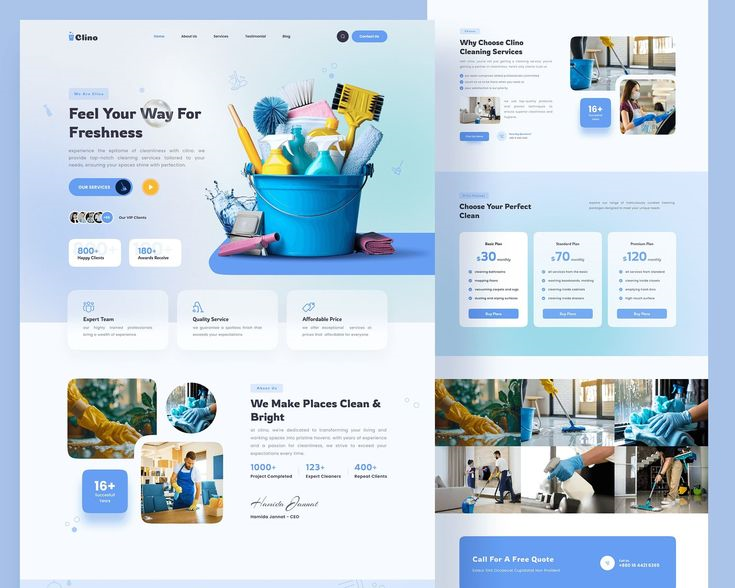
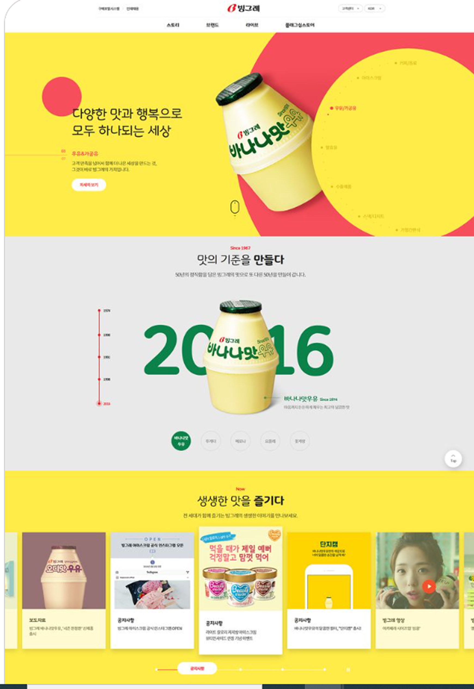
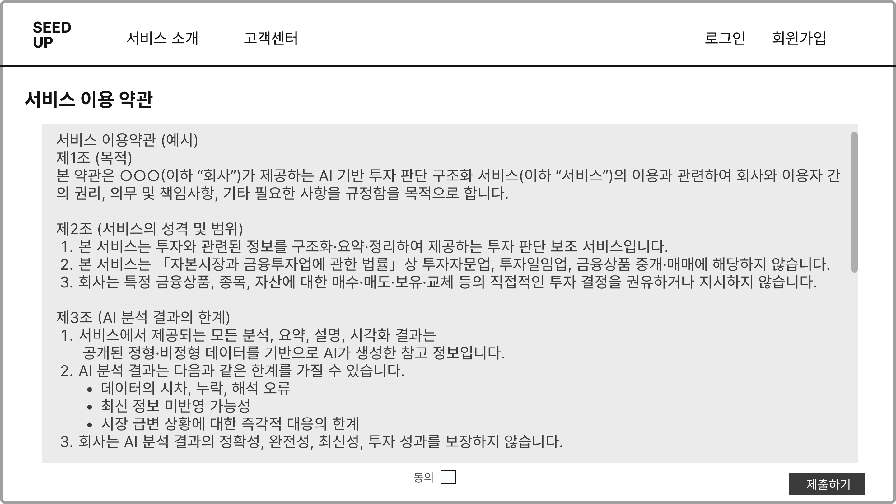
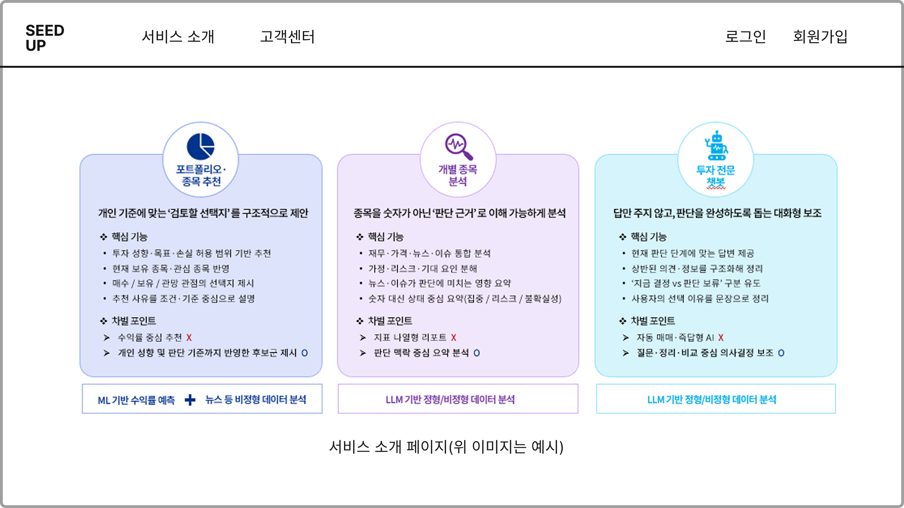
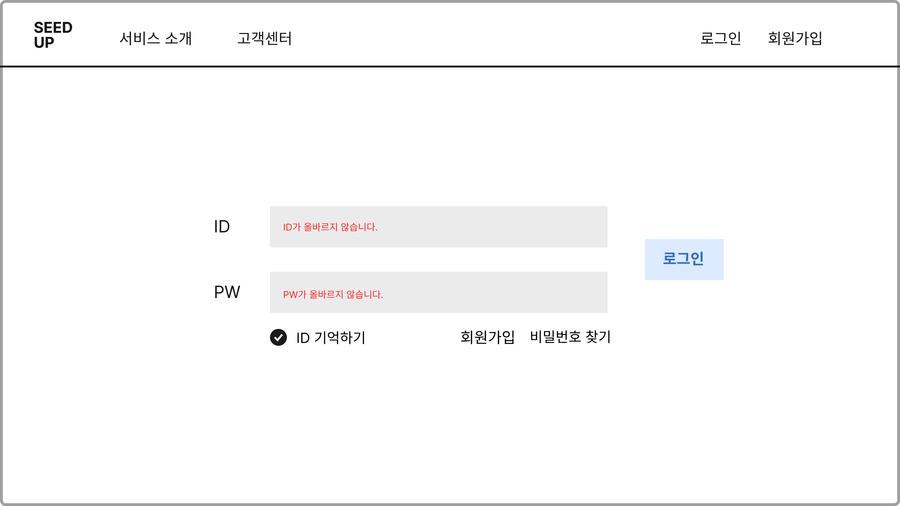
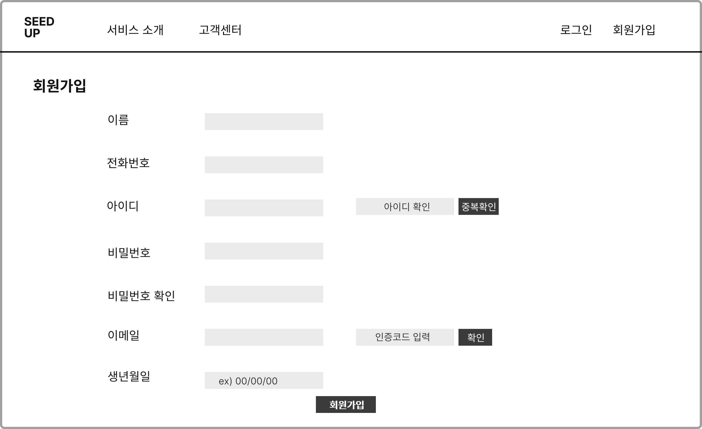

<!-- # 1. 디자인 레퍼런스

이 레퍼런스를 참고해서 디자인을 하고

색감은

이렇게 쓰고 싶어

약간 동의 와이어프레임은 이렇게 되어 있고

상단바는 seedup 로고, 서비스 소개, 고객센터, 로그인, 회원가입 고정으로 하고
서비스 이용 약관 및에 동의 란은 체크표시로 박스 클릭할 수 있게 하고 클릭이 되어야만 제출하기 버튼이 활성화 될 수 있게 해줘 -->


---

## 1) 디자인/레이아웃 스펙(레퍼런스 반영)

* **Reference UI**: `image.png` 스타일을 참고 (레이아웃, 컴포넌트 톤앤매너, 여백/라운딩/섀도우 느낌)
* **Color palette**: `colors.jpg`의 색감 사용 (Primary/Secondary/Background/Text 등으로 매핑)
* **Wireframe**: `02_Terms.jpg` 구조 기반으로 배치

> 가능하면 문장에 “어떤 요소를 참고하는지”를 더 명확히 적어줘.
> 예: “레퍼런스의 카드 형태, 버튼 스타일, 입력폼 라운딩, 섹션 간 여백을 따른다”

---

## 2) 페이지: 약관 동의(Terms) 요구사항

### 상단바(Header)

* 상단바는 **고정(sticky)**
* 좌측: **SeedUp 로고**
* 우측 메뉴: **서비스 소개 / 고객센터 / 로그인 / 회원가입**
* 메뉴 클릭 시:

  * 서비스 소개 → `/about`
  * 고객센터 → `/support`
  * 로그인 → `/login`
  * 회원가입 → `/signup`
  * 로고 클릭 → `/`

### 약관 동의 섹션(UI)

* “서비스 이용 약관 동의” 영역은 **체크박스 형태**로 제공
* 체크박스는 **박스(카드/행) 전체 클릭 시 토글 가능**

  * 체크박스 아이콘 클릭만 되는 게 아니라, **행 전체가 클릭 영역**
* 약관 항목 예시(필수/선택을 명시):

  * [필수] 서비스 이용약관 동의
  * [필수] 개인정보 처리방침 동의
  * [선택] 마케팅 정보 수신 동의

### 제출 버튼 활성화 조건

* 버튼 텍스트: `제출하기`
* 초기 상태: **disabled**
* 활성화 조건:

  * **필수 약관이 모두 체크되어야 enabled**
* 비활성화 상태 스타일: 흐린 색 + 클릭 불가(cursor not-allowed)

### 검증/에러(간단 버전)

* 사용자가 제출 버튼을 누를 수 있는 상태가 아니면 애초에 disabled라 눌리지 않게.
* (옵션) 필수 미동의 상태에서 안내문구:

  * `필수 약관에 동의해야 제출할 수 있어요.`

---

## 3) 바이브 코딩용으로 “한 번에 붙여넣는 스펙 문장” 예시

아래를 그대로 스펙으로 써도 돼:

* Terms(약관동의) 페이지를 제작한다. 디자인은 `image.png` 레퍼런스를 참고하고, 컬러는 `colors.jpg` 팔레트를 적용한다. 레이아웃은 `02_Terms.jpg` 와이어프레임을 따른다.
* 상단바는 sticky이며 구성은 좌측 SeedUp 로고, 우측 메뉴 `서비스 소개/고객센터/로그인/회원가입` 이고 모든 페이지에서 고정 노출한다.
* 약관 동의 영역은 체크박스 UI로 구현한다. 체크는 체크박스뿐 아니라 항목 박스(행) 전체 클릭으로 토글 가능해야 한다.
* `제출하기` 버튼은 초기 disabled이며, **필수 약관이 모두 체크된 경우에만 활성화**된다.

---


## 4) 약관동의 칸 텍스트는 이걸로 부탁해

### [필수] 서비스 이용약관 동의

제 1 조 (목적)

본 약관은 토스증권 주식회사(이하 “회사”라 합니다)가 제공하는 투자정보서비스(이하 “본 서비스”라 합니다)를 고객이 이용함에 있어서 필요한 사항을 정함을 목적으로 합니다.

제 2 조 (용어의 정의)

본 약관에서 사용하는 용어의 정의는 다음 각 호와 같습니다.

“토스앱”이란 회사가 고객에 대하여 증권매매거래 기타 서비스를 제공함에 있어서 이용하는 스마트폰 어플리케이션을 의미하며, “토스증권탭”이란 회사가 고객에 대하여 증권매매거래 기타 서비스를 제공함에 있어서 이용하는 화면으로서 고객이 토스앱을 통하여 진입할 수 있는 것을 의미합니다.
“WTS”란 회사가 고객에 대하여 증권매매거래 기타 서비스를 제공함에 있어서 이용하는 웹트레이딩시스템을 의미합니다.
“투자정보”란 금융투자에 관련된 지식 또는 정보로서 다음 각 목의 것을 포함하며, 본 서비스의 이용고객에게 송신, 배포, 게재할 목적으로 회사가 작성 또는 촬영, 이용권한 확보, 수집, 발췌, 편집, 배열, 구성, 결합, 번역 등을 한 것(글, 그림, 동영상 등 형태를 불문합니다)을 말합니다.
            가. 국내∙외 경제상황 또는 경제전망(주요국 경제 정책, 국제정세, 산업구조 변화 등에 관한 정보를 포함하고 이에 한정하지 않음)

            나. 국내∙외 금융투자상품시장의 상황 또는 전망(시장의 개폐, 시가총액, 거래량, 주가지수 등에 관한 정보를 포함하고 이에 한정하지 않음)

            다. 특정산업의 상황 및 전망

            라. 특정종목에 관련된 상황 및 전망(발행회사의 실적, 주요 뉴스 및 공시, 가격 변동, 시가총액, 거래량, 외국인∙기관 매매, 차입∙공매도, 기본적∙기술적 분석 및 지표, 투자유의 등에 관한 정보를 포함하고 이에 한정하지 않음)

            마. 금융투자에 관련된 법규정보, 이론 또는 가설 등 지식

            바. 금융투자에 관련된 통계적 기록, 금융투자에 관련된 역사적 사건에 관한 서술 또는 논평

            사. 그 밖에 금융투자에 관련된 지식 또는 정보

4. “투자정보서비스”란 투자정보를 토스증권탭의 일부 화면, 이메일, 휴대전화 문자메세지, 카카오톡 메시지, 토스앱의 푸쉬 메시지, 토스앱의 알림 화면, WTS 등의 매체를 통하여 주기적 또는 비주기적으로 송신하는 서비스를 말합니다.

... (이하 plan.md 내 약관 전체 본문을 그대로 이어서 삽입) ...

### [필수] 개인정보 처리방침 동의

개인정보 수집·이용 동의(투자정보서비스)
토스증권 주식회사(이하 토스증권)는 「개인정보 보호법」, 「신용정보의 이용 및 보호에 관한 법률」 등 관련 법령에 따라 고객님께 아래와 같은 '수집이용 목적, 수집이용 항목, 이용 및 보유기간, 동의 거부권 및 동의 거부 시 불이익에 관한 사항'을 안내 드리고 개인정보 수집▪이용 동의를 받고자 합니다.

수집이용 목적	투자정보서비스 제공
수집이용 항목
이름, 고객식별값, 휴대폰번호
이용 및 보유기간
서비스 해지·취소 시 또는 회원탈퇴 시 까지(단, 관련 법령에 따라 보존할 필요가 있는 경우는 해당 보존기간)

동의를 거부하는 경우에 대한 안내:
고객님께서는 개인정보 수집·이용 동의를 거부할 권리가 있습니다. 동의 거부 시 수집·이용 목적에 따른 투자정보서비스를 이용할 수 없습니다. 다만, 토스증권 계좌개설 또는 상품계약·체결·이행 등의 토스증권 이용에는 제한이 없습니다.

### [선택] 마케팅 정보 수신 동의

마케팅 정보 수신에 동의하시면 새로운 서비스 및 이벤트 정보를 받아보실 수 있습니다.

마케팅 정보는 이메일, SMS, 카카오톡 메시지, 푸쉬 알림 등의 방법으로 발송됩니다.

고객님께서는 언제든지 수신 거부 의사를 표시할 수 있으며, 수신 거부 후에도 서비스 이용에는 제한이 없습니다.

개인정보는 마케팅 목적으로만 사용되며, 제3자에게 제공되지 않습니다.

### [선택] 맞춤형 서비스 정보 수집·이용 동의

맞춤형 서비스 개인(신용)정보 수집·이용 요약동의

토스증권 주식회사(이하 토스증권)는 고객님의 토스증권 내 서비스 방문 이력, 활동 및 검색 이력 등을 이용하여 고객님께 맞춤형 서비스를 제공하기 위하여 개인(신용)정보를 다음과 같이 수집·이용하는 것에 동의를 받고자 합니다.

1. 수집·이용에 관한 사항

수집·이용 목적: 토스증권의 상품·서비스에 대한 맞춤형 서비스(광고, 컨텐츠, UI/UX 등)를 제공하기 위함

보유 및 이용기간: 동의 철회 또는 회원 탈퇴 시까지
※ 위 보유 기간에서의 동의철회란 "고객님께서 토스증권의 상품·서비스에 대한 맞춤형 서비스 제공 동의 철회"를 말합니다.

거부 권리 및 불이익: 고객님은 맞춤형 서비스 개인(신용)정보 수집·이용 동의를 거부할 권리가 있으며, 이용목적을 위한 선택적 사항이므로 동의하지 않더라도 토스증권의 다른 서비스 이용에는 제한이 없습니다. 다만, 동의하지 않을 경우 이용목적에 따른 맞춤형 서비스를 제공받지 못할 수 있습니다.

2. 수집·이용 항목

개인(신용)정보 (31개): 행태정보 및 기타 정보 수집으로 맞춤형 광고 및 서비스 제공

※ 만 14세 미만자의 행태정보 보호 안내:
토스증권은 만 14세 미만 아동의 행태정보는 맞춤형 광고에 활용하지 않으며, 이들에게는 맞춤형 광고를 제공하지 않습니다.

제 1 조 (목적)

본 약관은 토스증권 주식회사(이하 “회사”라 합니다)가 제공하는 투자정보서비스(이하 “본 서비스”라 합니다)를 고객이 이용함에 있어서 필요한 사항을 정함을 목적으로 합니다.

 

제 2 조 (용어의 정의)

본 약관에서 사용하는 용어의 정의는 다음 각 호와 같습니다.

“토스앱”이란 회사가 고객에 대하여 증권매매거래 기타 서비스를 제공함에 있어서 이용하는 스마트폰 어플리케이션을 의미하며, “토스증권탭”이란 회사가 고객에 대하여 증권매매거래 기타 서비스를 제공함에 있어서 이용하는 화면으로서 고객이 토스앱을 통하여 진입할 수 있는 것을 의미합니다.
“WTS”란 회사가 고객에 대하여 증권매매거래 기타 서비스를 제공함에 있어서 이용하는 웹트레이딩시스템을 의미합니다.
“투자정보”란 금융투자에 관련된 지식 또는 정보로서 다음 각 목의 것을 포함하며, 본 서비스의 이용고객에게 송신, 배포, 게재할 목적으로 회사가 작성 또는 촬영, 이용권한 확보, 수집, 발췌, 편집, 배열, 구성, 결합, 번역 등을 한 것(글, 그림, 동영상 등 형태를 불문합니다)을 말합니다.
            가. 국내∙외 경제상황 또는 경제전망(주요국 경제 정책, 국제정세, 산업구조 변화 등에 관한 정보를 포함하고 이에 한정하지 않음)

            나. 국내∙외 금융투자상품시장의 상황 또는 전망(시장의 개폐, 시가총액, 거래량, 주가지수 등에 관한 정보를 포함하고 이에 한정하지 않음)

            다. 특정산업의 상황 및 전망

            라. 특정종목에 관련된 상황 및 전망(발행회사의 실적, 주요 뉴스 및 공시, 가격 변동, 시가총액, 거래량, 외국인∙기관 매매, 차입∙공매도, 기본적∙기술적 분석 및 지표, 투자유의 등에 관한 정보를 포함하고 이에 한정하지 않음)

            마. 금융투자에 관련된 법규정보, 이론 또는 가설 등 지식

            바. 금융투자에 관련된 통계적 기록, 금융투자에 관련된 역사적 사건에 관한 서술 또는 논평

            사. 그 밖에 금융투자에 관련된 지식 또는 정보

4. “투자정보서비스”란 투자정보를 토스증권탭의 일부 화면, 이메일, 휴대전화 문자메세지, 카카오톡 메시지, 토스앱의 푸쉬 메시지, 토스앱의 알림 화면, WTS 등의 매체를 통하여 주기적 또는 비주기적으로 송신하는 서비스를 말합니다.


제 3 조 (서비스 제공)

① 회사는 본 약관에 따라 본 서비스의 이용이 승인된 고객(이하 “이용고객”)에 대하여 본 서비스를 제공합니다.

② 회사는 본 서비스를 제공함에 있어서 토스증권탭의 일부화면, 이메일, 휴대전화 문자메세지, 카카오톡 메시지, 토스앱의 푸쉬 메시지, 토스앱의 알림 화면, WTS 중 가용한 매체로 이용고객에게 투자정보를 송신, 게재, 배포하거나 투자정보의 신규 송신, 게재, 배포 사실을 통보합니다.

③ 고객은 토스증권탭의 설정 메뉴 내 알림 화면(또는 그와 유사한 명칭의 화면)을 통하여 휴대전화 문자메세지, 카카오톡 메시지 또는 토스앱의 푸쉬 메시지를 통한 투자정보의 수신 여부를 설정 및 변경할 수 있습니다.

④ 회사가 본 약관에 따라 제공하는 서비스의 내용은 별지「투자정보서비스 목록」에 따릅니다.

⑤ 회사는 이용고객의 금융투자 적정성 제고, 「영화 및 비디오물의 진흥에 관한 법률」 등 관계법규에 따른 등급산정 및 연령제한 준수, 청소년 보호 등을 위하여 본 서비스 이용고객 및 본 서비스의 이용을 희망하는 고객에게 연령, 투자자성향, 본인여부 등에 대한 인증 또는 응답을 요구할 수 있습니다.

 

제 4 조 (서비스이용료)

이용고객이 회사에 선납하는 본 서비스의 이용료(이하 “서비스이용료”)는 별첨1 「서비스이용료 구성표」에 따릅니다.

 

제 5 조 (서비스 이용신청)

① 고객은 본 약관에 동의하고 별첨 1 「서비스이용료 구성표」에 따른 기간별로 서비스이용료를 납부함으로써 해당기간에 대한 본 서비스의 이용을 신청합니다.

② 회사는 고객이 정확한 정보를 이용하여 정상적인 방법으로 본 서비스의 이용을 신청하는 경우에 그 신청을 승낙함을 원칙으로 합니다.

③ 제 2 항에도 불구하고 회사는 다음 각 호의 사유가 있는 경우에 본 서비스의 이용신청을 승낙하지 않을 수 있습니다.

회사에 피해를 입힐 목적으로 본 서비스를 이용할 위험이 있는 경우
본인의 금융투자를 위한 참고 이외에 다른 영리 목적으로 본 서비스를 이용할 위험이 있는 경우
고객의 연령 또는 투자자성향이 본 서비스를 제공받기에 적합 또는 적정하지 않은 경우
관계법규 또는 관계당국의 명령, 권고, 요청 등에 따라 고객의 이용신청을 승낙하는 것이 곤란한 경우
 

제 6 조 (서비스 이용제한)

① 회사는 다음 각 호의 경우에 이용고객의 본 서비스 이용을 제한할 수 있습니다.

고객의 연령 또는 투자자성향이 투자정보의 일부 또는 전부를 열람하기에 적합 또는 적정하지 않거나 고객이 투자권유를 희망하지 않는 경우
고객의 연령, 투자자성향, 본인여부 등에 대한 확인이 정상적으로 이루어지지 않는 경우
관계법규 또는 관계당국의 명령, 권고, 요청 등에 따라 이용고객에 대한 본 서비스의 제공이 곤란하게 된 경우
이용고객의 본 서비스에 대한 접근이 비정상적인 경우
이용고객이 본 약관의 중요한 사항을 위반하거나 투자정보에 대한 지적재산권을 침해한 경우
이용고객이 회사에 피해를 입힐 목적 또는 본인의 금융투자를 위한 참고 이외에 다른 영리 목적으로 본 서비스를 이용한 것으로 밝혀진 경우
해당기간에 대한 기간별 서비스이용료가 정상적으로 납부되지 않은 경우
② 회사는 제 1 항 각 호에 따라 이용고객의 본 서비스 이용을 제한하는 경우에 그 취지 및 사유를 이용고객에게 지체없이 통지하여야 합니다.

③ 회사는 제 1 항 제 1 호, 제 2 호, 제 3 호에 따라 이용고객의 본 서비스 이용을 제한하는 경우에 별첨 2 「서비스이용료 환급기준」에 따라 이용이 제한되는 부분에 해당되는 서비스이용료를 환급하여야 합니다.

 

제 7 조 (서비스 이용종료)

① 이용고객은 언제든지 본 약관에 대한 동의의 철회 또는 그 밖에 회사가 제공하는 방법으로 본 서비스의 이용을 종료할 수 있습니다.

② 제 1 항에 따라 본 서비스의 이용이 종료된 경우에 서비스이용료의 환급은 별첨 2 「서비스이용료 환급기준」에 따릅니다.


제 8 조 (서비스 중단 등)

① 회사는 기술상의 필요에 따라 본 서비스를 중단 또는 정지할 수 있습니다. 단, 이 경우에 회사는 그 취지 및 사유를 이용고객에게 지체없이 통지하여야 합니다.

② 회사는 운영상, 경영상, 기술상의 필요에 따라 이미 이용고객에게 송신한 투자정보를 변경할 수 있습니다. 단, 현저한 변경의 경우에는 그 취지 및 사유를 이용고객에게 지체없이 고지하여야 합니다.

③ 제 1 항에 따라 서비스를 중단 또는 정비하는 경우에 서비스이용료 환급은 별첨 2 「서비스이용료 환급기준」에 따릅니다.


제 9 조 (회사의 의무)

① 회사는 고객이 본 서비스를 안전하게 이용할 수 있도록 고객의 개인정보보호를 위한 보안체계를 갖추어야 하고, 개인정보처리방침을 공시 및 준수하여야 합니다.

② 회사는 본 서비스에 관하여 고객이 제기하는 의견 또는 불만이 객관적으로 정당하다고 인정될 경우에는 그 의견을 수용하거나 불만을 해결하기 위하여 노력합니다.


제 10 조 (고객의 의무)

① 고객은 본 약관, 본 서비스의 이용정책, 관계법규를 준수하며, 본 서비스의 원활한 제공을 방해하거나 방해를 시도하여서는 안 됩니다.

② 고객은 본 서비스를 이용함에 있어서 회사가 제공하는 방법을 이용하며, 그 밖에 비정상적인 방법으로 회사의 정보처리시스템에 접근하지 않습니다.

③ 고객은 본 서비스를 이용함에 있어서 타인의 명의를 이용하여서는 안 됩니다.

④ 고객은 투자정보의 내용을 영리적인 용도로 편집, 복제, 배포하여서는 안 되며, 관계법규를 준수하여 회사의 저작물을 이용하는 경우에도 그 출처를 반드시 명시합니다.


제 11 조 (업무위탁 등)

회사는 투자정보의 작성 또는 촬영, 이용권한 확보, 수집, 발췌, 편집, 배열, 구성, 결합, 번역, 송신에 있어서 일부 업무를 제3자에게 위탁하거나 제3자와 업무제휴 할 수 있습니다.

 

제 12 조 (약관의 변경)

① 회사는 본 약관을 변경하고자 하는 경우에 회사의 인터넷 홈페이지에 변경내용을 변경되는 약관의 시행일 30일 전에 게시하여야 합니다. 단, 관련 법령의 제정 또는 개정 등 제도의 변경에 따라 약관이 변경되는 경우로서 본문에 따라 게시하기 어려운 급박하고 부득이한 사정이 있는 경우에는 본문에도 불구하고 시행일 전에 게시할 수 있습니다.

② 제1항의 변경내용이 본 서비스 이용고객에게 불리한 것일 때에 회사는 이메일, 휴대전화 문자메세지, 카카오톡 메시지, 토스앱의 푸쉬 메시지 중 고객과 사전에 합의한 하나 이상의 방법으로 변경되는 약관의 시행일 1개월 전까지 통지하여야 합니다. 다만, 기존 본 서비스 이용고객에게 변경 전 내용이 그대로 적용되는 경우 또는 이용고객이 변경 내용에 대한 통지를 받지 아니하겠다는 의사를 분명히 표시한 경우에는 그러하지 아니합니다.

③ 회사는 제2항의 통지를 할 경우 “투자정보서비스 이용고객이 투자정보서비스 이용약관의 변경에 동의하시지 않는 경우에는 투자정보서비스 이용을 종료하실 수 있으며, 통지를 받은 날로부터 변경되는 약관의 시행일 전의 영업일까지 이용종료의 의사표시를 하지 않으신 경우에는 변경에 동의하신 것으로 봅니다.”라는 취지의 내용을 통지하여야 합니다.

④ 고객이 제3항의 통지를 받은 날로부터 변경되는 약관의 시행일 전의 영업일까지 본 서비스 이용종료의 의사표시를 하지 아니하는 경우에는 변경에 동의한 것으로 봅니다.

⑤ 본 약관은 관계법규 및 내부통제기준에 따라 본 서비스 이용고객에게 제공됩니다.

⑥ 회사는 본 약관을 토스앱 또는 회사의 인터넷 홈페이지 그 밖에 이와 유사한 전자통신매체 중 하나 이상에 게시하여 본 서비스 이용고객이 본 약관을 조회하고 다운로드(화면출력 포함) 받을 수 있도록 하여야 합니다.


제 13 조  (면책)

회사는 회사의 책임이 없는 경우로서 다음 각 호의 어느 하나에 해당하는 사유로 인하여 고객에게 발생되는 손해에 대하여 책임을 지지 않습니다.

천재지변, 전쟁, 폭동, 해킹, 전산장애, 통신장애, 전력장애, DDOS, 기타 이에 준하는 사유로 인한 본 서비스 제공의 중단 또는 정지
금융위원회, 금융감독원, 한국거래소, 다자간매매체결회사(넥스트레이드), 기타 이에 준하는 기관의 명령, 권고, 요청 등에 따른 본 서비스 제공의 중단 또는 정지
고객의 책임 있는 사유
 

제 14 조 (관련법령의 준용)

본 약관에서 정하지 아니한 사항은 별도의 약정이 없는 한 관계법규 및 관련 약관에서 정하는 바에 따르며, 관계법규 및 관련 약관에도 정함이 없는 경우에는 일반적인 상관례에 따릅니다.

 

제 15 조 (분쟁조정)

고객은 본 서비스와 관련하여 회사와 분쟁이 발생하는 경우에 회사의 민원처리기구에 그 해결을 요구하거나 금융감독원, 한국금융투자협회, 한국거래소 등에 분쟁조정을 신청할 수 있습니다. 단, 이 약관에 의한 거래와 관련하여 발생된 분쟁에 대하여 회사와 고객 사이에 소송의 필요가 생긴 경우에는 그 관할법원은 「금융소비자 보호에 관한 법률」 제 66 조의 2 에 따라 방문판매 및 유선 · 무선 · 화상통신 · 컴퓨터 등 정보통신기술을 활용한 비대면 방식을 통한 금융상품 계약과 관련된 소는 제소 당시 고객 주소를, 주소가 없는 경우에는 거소를 관할하는 지방법원의 전속관할로 합니다. 다만, 제소 당시 고객의 주소 또는 거소가 분명하지 아니한 경우 또는 본문에서 정한 비대면 방식을 통한 금융상품 계약에 해당하지 않는 경우의 관할법원은 「민사소송법」이 정한 바에 따릅니다.

 

제 16 조 (기타)

본 약관에서 정하지 아니한 사항은 관계법규에 저촉되지 않는 범위 내에서 회사와 본 서비스 이용고객이 합의하여 정할 수 있습니다.

 

부칙 

본 약관은 2022년 5월 23일부터 시행합니다.

 

부칙

본 약관은 2022년 8월 1일부터 시행합니다.

 

부칙

본 약관은 2023년 5월 1일부터 시행합니다.


부칙

본 약관은 2024년 3월 28일부터 시행합니다.


부칙

본 약관은 2024년 5월 27일부터 시행합니다.


부칙

본 약관은 2025년 4월 7일부터 시행합니다.


부칙

본 약관은 2026년 1월 15일부터 시행합니다.


별지 「투자정보서비스 목록」

회사가 본 약관에 따라 제공하는 개별 투자정보서비스의 구체적인 내역은 회사 홈페이지에 게시하며,

아래 경로를 통해 확인할 수 있습니다.

토스증권 홈페이지> 고객센터> 증권 업무> 투자정보서비스


별첨1 「서비스이용료 구성표」

무료

※ 유료로 변경할 경우에 회사는 최소 30일 전에 이용고객에게 통지하고 이용종료 방법을 상세히 안내하여야 함

 

별첨2 「서비스이용료 환급기준」

서비스 이용료는 무료이므로, 환급되지 않음


개인정보 수집·이용 동의(투자정보서비스)
토스증권 주식회사(이하 토스증권)는 「개인정보 보호법」, 「신용정보의 이용 및 보호에 관한 법률」 등 관련 법령에 따라 고객님께 아래와 같은 '수집이용 목적, 수집이용 항목, 이용 및 보유기간, 동의 거부권 및 동의 거부 시 불이익에 관한 사항'을 안내 드리고 개인정보 수집▪이용 동의를 받고자 합니다.

수집이용 목적	투자정보서비스 제공
수집이용 항목
이름, 고객식별값, 휴대폰번호
이용 및 보유기간
서비스 해지·취소 시 또는 회원탈퇴 시 까지(단, 관련 법령에 따라 보존할 필요가 있는 경우는 해당 보존기간)


동의를 거부하는 경우에 대한 안내:
고객님께서는 개인정보 수집·이용 동의를 거부할 권리가 있습니다. 동의 거부 시 수집·이용 목적에 따른 투자정보서비스를 이용할 수 없습니다. 다만, 토스증권 계좌개설 또는 상품계약·체결·이행 등의 토스증권 이용에는 제한이 없습니다.


#### 추가로 이 약관동의도 넣어줘
https://corp.tossinvest.com/ko/contents/consent?id=117

---

## main 페이지

## 로그인 페이지

## 회원가입 페이지

## 설문조사 페이지

좋아.
아래는 **그대로 바이브 코딩에 넣어도 구현이 흔들리지 않는 최종 스펙 문서**야.
(범위 명확화 + DB 구조 + API 설계 + 검증 규칙 포함)

---

# ✅ SeedUp MVP 최종 개발 스펙

---

# 1. 기술 스택

## Frontend

* React (Vite)
* React Router
* 완전 반응형 (Desktop 1200px 기준 / Mobile 대응)
* API 통신: fetch or axios

## Backend

* FastAPI
* SQLite
* SQLAlchemy ORM
* Pydantic Schema 사용

---

# 2. 네이밍 규칙

## Backend (Python)

* 함수/변수: snake_case
* 클래스: PascalCase
* JSON key: snake_case
* DB 컬럼명: snake_case

## Frontend (React)

* 컴포넌트: PascalCase
* 함수: camelCase
* 변수/상태: camelCase
* API JSON은 snake_case 유지

---

# 3. 공통 UI 레이아웃

## Header (홈/회원가입/로그인/설문 공통)

* sticky 상단 고정
* 좌측: SeedUp 로고 (클릭 시 `/`)
* 좌측 메뉴:

  * 서비스 소개 → `/about`
  * 고객센터 → `/support`
* 우측 메뉴:

  * 로그인 → `/login`
  * 회원가입 → `/signup`

---

# 4. DB 설계

## 1️⃣ users 테이블

| 컬럼명        | 타입              |
| ---------- | --------------- |
| id         | Integer (PK)    |
| email      | String (unique) |
| password   | String (hashed) |
| created_at | DateTime        |

---

## 2️⃣ survey_questions 테이블

| 컬럼명           | 타입           |
| ------------- | ------------ |
| id            | Integer (PK) |
| question_text | String       |
| is_required   | Boolean      |
| question_type | String       |
| created_at    | DateTime     |

question_type 예시:

* text
* number
* radio
* select

※ 서버 시작 시 seed 데이터로 문항 자동 삽입

---

## 3️⃣ survey_answers 테이블

| 컬럼명          | 타입                      |
| ------------ | ----------------------- |
| id           | Integer (PK)            |
| user_id      | FK(users.id)            |
| question_id  | FK(survey_questions.id) |
| answer_text  | String (LLM 전달용 원본값)    |
| answer_value | Integer (숫자형 저장 필요 시)   |
| created_at   | DateTime                |

✔ 금액 관련 문항은:

* answer_value = 숫자 저장
* answer_text = "1000000원" 형태 저장

---

# 5. API 설계

---

## 회원가입

### POST `/auth/signup`

Request:

```json
{
  "email": "test@test.com",
  "password": "1234"
}
```

동작:

* 이메일 중복 체크
* 비밀번호 해싱 저장
* users 테이블 저장

Response:

```json
{
  "message": "signup_success",
  "user_id": 1
}
```

---

## 로그인

### POST `/auth/login`

Request:

```json
{
  "email": "test@test.com",
  "password": "1234"
}
```

동작:

* DB 사용자 조회
* 비밀번호 검증
* 사용자 기본정보 + 설문답변 조회

Response:

```json
{
  "user": {...},
  "survey_answers": [...]
}
```

설문 없으면 빈 배열 반환

---

## 설문 문항 조회

### GET `/survey/questions`

Response:

```json
[
  {
    "id": 1,
    "question_text": "...",
    "is_required": true,
    "question_type": "text"
  }
]
```

---

## 설문 제출

### POST `/survey/answers`

Request:

```json
{
  "user_id": 1,
  "answers": [
    {
      "question_id": 1,
      "answer_text": "자산증식",
      "answer_value": null
    }
  ]
}
```

동작:

* 기존 답변 있으면 삭제 후 재저장 (업데이트 전략)
* survey_answers 테이블 저장

---

## LLM 전송용 데이터 조회

### GET `/survey/merged/{user_id}`

Response:

```json
[
  {
    "question": "투자 목적은 무엇인가요?",
    "answer": "자산증식"
  }
]
```

LLM에는 질문+답변 매핑된 형태로 전달

---

# 6. 화면 상세 기능

---

# 🏠 1. 홈화면

* 로그인 버튼 → `/login`
* 회원가입 버튼 → `/signup`

---


# 📝 2. 회원가입 화면
* 이름
* 전화번호 (숫자만 입력만 가능, 하이픈 자동 제거)
* ID (중복확인 자동, 중복 시 에러 및 재입력)
* 이메일
* 비밀번호
* 생년월일

> **회원가입 버튼 클릭 시**
> - 약관동의 팝업이 반드시 먼저 뜬다.
> - 사용자가 모든 필수 약관에 동의해야만 회원가입이 실제로 진행된다.
> - 팝업 내 약관 동의 UI는 체크박스/전체동의/필수/선택 구분, 스크롤 등 구현 가능.
> - 동의하지 않으면 회원가입 요청이 서버로 전송되지 않는다.
> - (UX) 팝업 내에서 동의 후 '회원가입 계속' 버튼을 눌러야 최종 제출됨.

회원가입 완료 시:

1. DB 저장
2. 완료 팝업 표시
3. 팝업 확인 시 `/survey` 이동

---

# 🔐 3. 로그인 화면

* 이메일
* 비밀번호
* 로그인 성공 시:

  * 사용자 정보 + 설문 데이터 로딩
  * `/survey` 또는 `/dashboard` 이동

---

# 📊 4. 개인화 설문 화면

## 페이지 타이틀

**나에게 맞는 투자 설계하기**

하단 설명문:

> 입력하신 정보는 개인 맞춤 분석에 활용되며, 구체적일수록 추천의 정확도가 높아집니다.

---


---

# ✅ 약관 동의(회원가입 시) UI/항목/텍스트/동작

* 회원가입 버튼 클릭 시, **약관동의 팝업**이 반드시 먼저 뜬다.
* 팝업 내 약관 동의 UI는 **체크박스/전체동의/필수/선택 구분, 스크롤** 등 구현 가능.
* **필수 약관** 모두 동의해야만 '회원가입 계속' 버튼이 활성화된다.
* 동의하지 않으면 회원가입 요청이 서버로 전송되지 않는다.
* (UX) 팝업 내에서 동의 후 '회원가입 계속' 버튼을 눌러야 최종 제출됨.


### 약관 항목 및 전문(실제 텍스트)

| 구분   | 제목                        |
|--------|-----------------------------|
| [필수] | 서비스 이용약관 동의         |
| [필수] | 개인정보 처리방침 동의       |
| [선택] | 마케팅 정보 수신 동의        |
| [선택] | 맞춤형 서비스 정보 수집·이용 동의 |

각 항목은 **박스(카드/행) 전체 클릭 시 토글** 가능해야 하며, 체크박스만 클릭되는 것이 아니라 **행 전체가 클릭 영역**이어야 함.

#### 서비스 이용약관 동의 (전문)

제 1 조 (목적)

본 약관은 토스증권 주식회사(이하 “회사”라 합니다)가 제공하는 투자정보서비스(이하 “본 서비스”라 합니다)를 고객이 이용함에 있어서 필요한 사항을 정함을 목적으로 합니다.

... (중략: plan.md 내 약관 전체 복사, 실제 파일에는 전체 약관이 들어가야 함) ...

#### 개인정보 처리방침 동의 (전문)

개인정보 수집·이용 동의(투자정보서비스)
토스증권 주식회사(이하 토스증권)는 「개인정보 보호법」, 「신용정보의 이용 및 보호에 관한 법률」 등 관련 법령에 따라 고객님께 아래와 같은 '수집이용 목적, 수집이용 항목, 이용 및 보유기간, 동의 거부권 및 동의 거부 시 불이익에 관한 사항'을 안내 드리고 개인정보 수집▪이용 동의를 받고자 합니다.

수집이용 목적	투자정보서비스 제공
수집이용 항목
이름, 고객식별값, 휴대폰번호
이용 및 보유기간
서비스 해지·취소 시 또는 회원탈퇴 시 까지(단, 관련 법령에 따라 보존할 필요가 있는 경우는 해당 보존기간)

동의를 거부하는 경우에 대한 안내:
고객님께서는 개인정보 수집·이용 동의를 거부할 권리가 있습니다. 동의 거부 시 수집·이용 목적에 따른 투자정보서비스를 이용할 수 없습니다. 다만, 토스증권 계좌개설 또는 상품계약·체결·이행 등의 토스증권 이용에는 제한이 없습니다.

#### 마케팅 정보 수신 동의 (전문)

마케팅 정보 수신에 동의하시면 새로운 서비스 및 이벤트 정보를 받아보실 수 있습니다.

마케팅 정보는 이메일, SMS, 카카오톡 메시지, 푸쉬 알림 등의 방법으로 발송됩니다.

고객님께서는 언제든지 수신 거부 의사를 표시할 수 있으며, 수신 거부 후에도 서비스 이용에는 제한이 없습니다.

개인정보는 마케팅 목적으로만 사용되며, 제3자에게 제공되지 않습니다.

#### 맞춤형 서비스 정보 수집·이용 동의 (전문)

맞춤형 서비스 개인(신용)정보 수집·이용 요약동의

토스증권 주식회사(이하 토스증권)는 고객님의 토스증권 내 서비스 방문 이력, 활동 및 검색 이력 등을 이용하여 고객님께 맞춤형 서비스를 제공하기 위하여 개인(신용)정보를 다음과 같이 수집·이용하는 것에 동의를 받고자 합니다.

1. 수집·이용에 관한 사항

수집·이용 목적: 토스증권의 상품·서비스에 대한 맞춤형 서비스(광고, 컨텐츠, UI/UX 등)를 제공하기 위함

보유 및 이용기간: 동의 철회 또는 회원 탈퇴 시까지
※ 위 보유 기간에서의 동의철회란 "고객님께서 토스증권의 상품·서비스에 대한 맞춤형 서비스 제공 동의 철회"를 말합니다.

거부 권리 및 불이익: 고객님은 맞춤형 서비스 개인(신용)정보 수집·이용 동의를 거부할 권리가 있으며, 이용목적을 위한 선택적 사항이므로 동의하지 않더라도 토스증권의 다른 서비스 이용에는 제한이 없습니다. 다만, 동의하지 않을 경우 이용목적에 따른 맞춤형 서비스를 제공받지 못할 수 있습니다.

2. 수집·이용 항목

개인(신용)정보 (31개): 행태정보 및 기타 정보 수집으로 맞춤형 광고 및 서비스 제공

※ 만 14세 미만자의 행태정보 보호 안내:
토스증권은 만 14세 미만 아동의 행태정보는 맞춤형 광고에 활용하지 않으며, 이들에게는 맞춤형 광고를 제공하지 않습니다.

---

# 설문 문항 구성

---

## 1️⃣ 투자 목적* (필수, text)

placeholder:
자산증식 / 목돈 / 주택 / 결혼 / 은퇴 / 학자금

---

## 2️⃣ 목표 시점* (필수, text)

(주관식)

---

## 3️⃣ 목표 금액 (선택, number)

* 숫자만 입력 가능 (input type="number", 음수/소수점 불가)
* input 오른쪽에 suffix "원" (placeholder 예: 1000000)
* 입력값은 3자리마다 콤마(,) 자동 포맷팅, 입력 시 실시간으로 "1,000,000원" 형태로 보이게 함
* DB 저장:
  * answer_value = 숫자 (예: 1000000)
  * answer_text = "1,000,000원" (콤마+원화표기)
* (UX) 사용자는 숫자만 입력, UI에서 직관적으로 금액 단위와 포맷을 확인할 수 있어야 함

---

## 4️⃣ 선호 투자 방식* (radio)

* 일시금
* 적립식

### 일시금 선택 시:

→ 4-1 입력란 표시 (필수)

* 숫자 입력
* suffix "원"

### 적립식 선택 시:

→ 4-2 입력란 표시 (필수)

* 숫자 입력
* suffix "원"

---

## 5️⃣ 최대 보유 종목 수 선호* (text)

placeholder:
5개 / 10개 / 20개 이상

---

## 6️⃣ 배당 선호도* (radio)

* 상
* 중
* 하

---

## 7️⃣ 계좌 유형* (text)

placeholder:
일반 / ISA / 연금 / 없음 / 복수 가능

---

# 제출 버튼 규칙

* 초기 상태 disabled
* 필수 문항 모두 입력 시 enabled
* 4번 선택에 따른 4-1/4-2도 필수 조건 포함
* 3번은 미입력 가능

---

# 7. 프론트 검증 규칙

* 숫자 입력란:

  * input type="number"
  * 음수 불가
  * 소수점 불가
* 버튼 비활성 상태:

  * opacity 낮음
  * cursor: not-allowed

---

# 8. LLM 연동 준비 설계

LLM 전송 데이터 예시:

```json
{
  "user_id": 1,
  "survey": [
    {
      "question": "투자 목적은 무엇인가요?",
      "answer": "자산증식"
    }
  ]
}
```

---

# 9. 범위 제외 (이번 MVP)

* 관리자 문항 관리 화면
* JWT 인증
* 소셜 로그인
* 대시보드 분석 결과 화면

---

