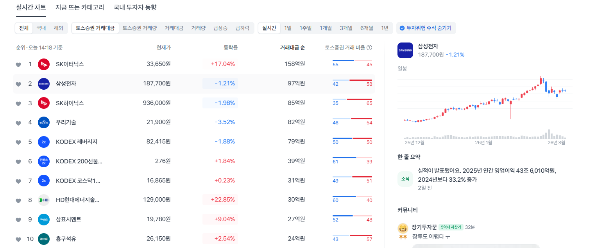
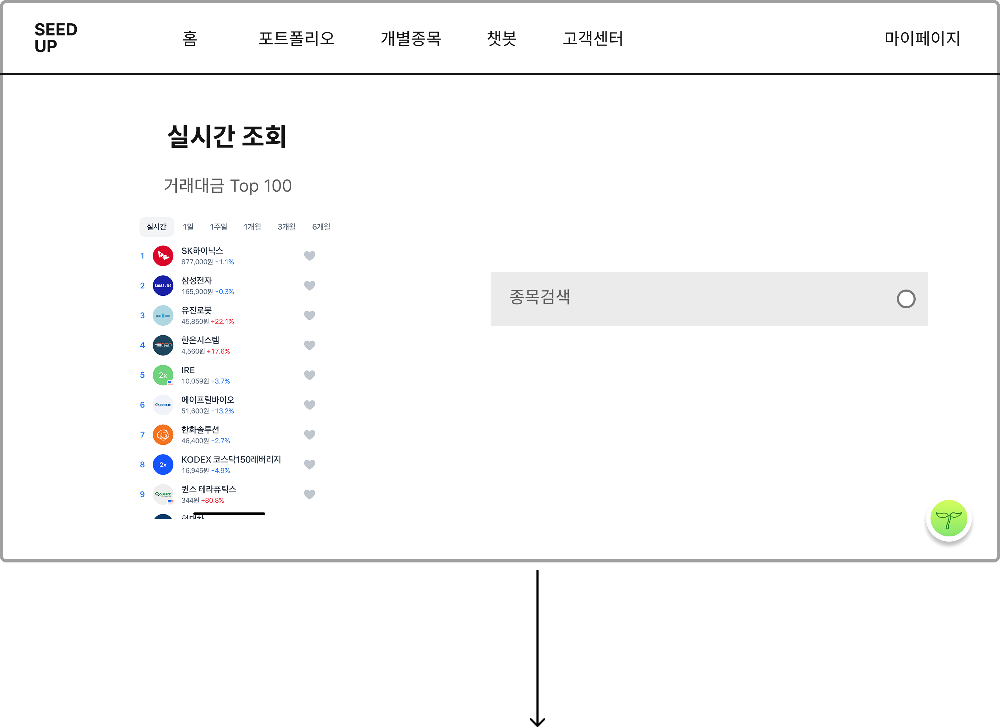

# 개별종목 페이지 구현 프롬프트

아래 요구사항을 바탕으로 **SEED UP 서비스의 개별종목 페이지**를 구현해줘.
기본 베이스는 현재 프로젝트의 **design-system 컴포넌트 / 토큰 / spacing / typography / color system**을 최대한 우선 사용하고, 디테일한 UI 완성도는 첨부한 레퍼런스 이미지를 참고해서 더 세련되고 실제 서비스처럼 보이게 만들어줘.

---

## 1. 작업 목표

개별종목 페이지는 사용자가 **실시간으로 많이 거래되는 종목을 탐색**하고, **종목명을 검색**해서 원하는 종목의 **상세 페이지로 이동**할 수 있는 화면이다.

레퍼런스 이미지 기준으로 전체적인 구조는 다음과 같다.

* 상단: 기존 서비스 공통 헤더 사용
* 메인 상단: 페이지 타이틀과 간단한 설명
* 좌측 영역:

  * 거래대금 Top 100 리스트
  * 기간 필터 탭
  * 관심종목(즐겨찾기) 토글 가능 구조 고려
* 우측 영역:

  * 종목 검색 입력창
  * 추후 선택 종목의 요약/차트/상세 정보가 자연스럽게 연결될 수 있는 구조 고려
* 우하단: 기존 서비스의 플로팅 버튼이 있다면 유지

단, 단순한 와이어프레임 수준이 아니라 **정돈된 핀테크 서비스 느낌의 실제 프로덕트 UI**로 만들어줘.

---

## 2. 구현 방향

### 공통 방향

* 기존 프로젝트의 **design-system을 최우선 사용**
* 없는 컴포넌트만 최소한으로 커스텀 스타일 추가
* 반응형 고려

  * desktop 우선
  * tablet에서도 자연스럽게 유지
  * 모바일에서는 종목 리스트와 검색 영역이 1단 구조로 전환
* 전체적으로 **깔끔하고 신뢰감 있는 투자/금융 서비스 UI** 톤으로 구현
* 과한 장식보다 **좋은 정보 구조 / 균형 잡힌 여백 / 선명한 위계** 중심

### 스타일 방향

* 회색 박스만 놓인 밋밋한 화면이 아니라 아래 요소를 활용해서 완성도 있게 정리

  * 섹션 카드
  * 필터 탭 active 상태
  * 리스트 hover / selected 상태
  * 검색창 focus 상태
  * 종목 등락 색상 체계
  * 빈 상태 / 로딩 상태 / 에러 상태
* 컬러는 design-system 기준을 따르되,

  * 브랜드 컬러는 포인트로 사용
  * 상승/하락은 금융 서비스 관례에 맞는 컬러 사용
  * 전체 배경은 너무 누렇거나 칙칙하지 않게 뉴트럴하게 정리
* 타이포그래피는 제목 / 섹션명 / 종목명 / 가격 / 변화율 위계를 명확히 해줘

---

## 3. 페이지 구조

### 페이지 목적

이 페이지는 크게 두 가지 역할을 한다.

1. 실시간 인기 종목 탐색
2. 종목 검색 후 상세 페이지 진입

### 추천 구조

```tsx
<StockPage>
  <StockPageHeader />
  <StockPageBody>
    <TopStocksSection />
    <StockSearchSection />
  </StockPageBody>
</StockPage>
```

### 데스크탑 레이아웃

* 좌측: 거래대금 Top 100 리스트 카드
* 우측: 검색 카드 + 안내/빈상태 영역

### 모바일 레이아웃

* 상단: 검색
* 하단: 거래대금 Top 100 리스트
* 또는 검색과 리스트를 세로 배치

---

## 4. 페이지 헤더 요구사항

### 포함 요소

* 타이틀: `실시간 조회`
* 서브 타이틀/설명: `거래대금 Top 100`

### 디자인 가이드

* 상단 공백을 충분히 두고 제목을 명확하게 보여줘
* 단순 텍스트 나열보다 서비스 화면처럼 정리
* 필요하면 작은 보조 설명 추가 가능

  * 예: `실시간으로 거래가 활발한 종목을 확인하고 원하는 종목을 검색해보세요.`

---

## 5. 좌측 - 거래대금 Top 100 섹션 요구사항

### 구성 요소

1. 기간 필터 탭

   * 실시간
   * 1일
   * 1주일
   * 1개월
   * 3개월
   * 6개월
2. 종목 리스트

   * 순위
   * 종목 로고 또는 썸네일(없으면 이니셜/기본 아이콘)
   * 종목명
   * 현재가
   * 등락률
   * 관심종목 버튼(하트/북마크)

### 동작

* 기간 탭 클릭 시 정렬 기준/데이터 변경
* 리스트 행 클릭 시 종목 상세 페이지로 이동
* 관심종목 버튼 클릭 시 즐겨찾기 토글
* 현재 선택된 종목은 selected 상태 표시

### UX 요구사항

* 스크롤 가능한 리스트 구조
* 항목 hover 시 강조
* selected 항목은 배경/보더/좌측 바 등으로 구분
* 관심종목 버튼은 행 클릭과 이벤트 충돌 없게 처리
* 로딩 시 skeleton 또는 shimmer 제공
* 데이터 없을 때 empty state 제공

### 디자인 가이드

* 너무 표(table)처럼 딱딱하지 않게 **리스트 카드 UI**로 구성
* 각 row는 compact하지만 정보가 답답하지 않게 간격 확보
* 순위 숫자는 subtle하게, 종목명이 가장 잘 보여야 함
* 가격과 등락률은 읽기 쉽게 정렬
* 상승/하락 컬러는 시각적으로 명확하되 과도하게 자극적이지 않게

---

## 6. 우측 - 종목 검색 섹션 요구사항

### 구성 요소

1. 검색창

   * placeholder 예: `종목명 또는 종목코드를 검색해보세요`
   * 검색 아이콘 포함
2. 검색 결과 드롭다운 또는 자동완성 리스트
3. 초기 안내/빈 상태 영역

### 동작

* 종목명 또는 종목코드 입력 가능
* 입력 시 자동완성 후보 노출 가능
* 결과 클릭 시 해당 종목 상세 페이지로 이동
* 엔터 입력 시 첫 번째 결과 또는 정확히 일치하는 결과로 이동 가능

### 상세 페이지 이동 규칙

예시:

* `/stocks/:symbol`
* `/stock/:code`

현재 프로젝트 라우팅 방식에 맞춰 자연스럽게 연결해줘.

### UX 요구사항

* 입력 debounce 고려
* 검색어 없을 때 기본 안내 문구 표시
* 검색 결과 없을 때 empty state 표시
* API 호출 중 로딩 상태 표시
* 키보드 탐색(위/아래/엔터) 가능하면 좋음

### 디자인 가이드

* 레퍼런스처럼 넓은 검색창 구조를 사용하되 더 완성도 높게 개선
* 단순 회색 박스가 아니라 카드 또는 서치 패널처럼 보이게
* focus 상태에서 보더/그림자/포인트 컬러 자연스럽게 반영
* 우측 영역은 추후 차트/종목 요약을 붙여도 어색하지 않게 여백과 구조를 설계

---

## 7. 실시간 종목 차트 연동 방향

실시간 종목 차트 데이터는 **한국투자 API**로 불러올 예정이다.
현재 이 페이지에서는 차트를 직접 크게 보여주지 않아도 되지만, 아래를 고려해서 구조를 설계해줘.

### 고려사항

* 종목 선택 후 상세 페이지에서 차트 영역 확장 가능
* 차트 위젯 또는 차트 카드가 붙기 쉬운 레이아웃
* API 로딩/에러 상태 분리
* polling / websocket / 주기 갱신 구조로 확장 가능하도록 설계

### 구현 방향

* 현재 페이지는 `실시간 탐색 + 검색 진입` 중심
* 종목 상세 페이지에서 한국투자 API 기반 차트 컴포넌트가 자연스럽게 재사용되도록 설계
* 리스트 데이터와 검색 결과 데이터의 shape를 최대한 일관성 있게 맞춰줘

---

## 8. 종목 상세 페이지 연계 고려사항

검색 또는 리스트 클릭 시 이동할 종목 상세 페이지를 염두에 두고 아래 정보를 전달 가능하게 해줘.

* 종목 코드
* 종목명
* 시장 구분(코스피/코스닥/ETF 등)
* 현재가
* 전일 대비
* 등락률

라우팅 시 예시:

```tsx
navigate(`/stocks/${stock.code}`)
```

또는 프로젝트 구조에 맞춰 링크 방식 사용.

---

## 9. 컴포넌트 설계 가이드

가능하면 아래처럼 분리해줘.

```tsx
StockPage
 ├─ StockPageHeader
 ├─ TopStocksSection
 │   ├─ StockPeriodTabs
 │   ├─ TopStockList
 │   └─ TopStockListItem
 └─ StockSearchSection
     ├─ StockSearchInput
     ├─ StockSearchResults
     └─ EmptyState
```

### 추가 권장 컴포넌트

* `PriceChangeBadge`
* `FavoriteButton`
* `SectionCard`
* `SearchInput`
* `StockLogo`
* `SkeletonRow`

---

## 10. 상태 관리 가이드

초기 구현은 mock data 기반으로 만들고, 이후 API 연동이 쉬운 형태로 구조화해줘.

예시 상태:

```tsx
const [period, setPeriod] = useState<'realtime' | '1d' | '1w' | '1m' | '3m' | '6m'>('realtime')
const [selectedStockCode, setSelectedStockCode] = useState<string | null>(null)
const [searchKeyword, setSearchKeyword] = useState('')
const [favoriteStockCodes, setFavoriteStockCodes] = useState<string[]>([])
```

### 리스트

* mock top stocks 배열 정의
* 기간별 mock 데이터 또는 필터 구조 준비
* 선택된 종목 상태 관리

### 검색

* mock search result 배열 정의
* 입력값에 따른 필터링
* 결과 선택 시 상세 페이지 이동

---

## 11. 데이터 예시

### 거래대금 Top 100 예시 데이터 구조

```tsx
const topStocks = [
  {
    rank: 1,
    code: '000660',
    name: 'SK하이닉스',
    market: 'KOSPI',
    price: 877000,
    changeRate: -1.1,
    logoUrl: '',
    isFavorite: false,
  },
  {
    rank: 2,
    code: '005930',
    name: '삼성전자',
    market: 'KOSPI',
    price: 165900,
    changeRate: -0.3,
    logoUrl: '',
    isFavorite: false,
  },
]
```

### 검색 결과 예시 데이터 구조

```tsx
const searchResults = [
  {
    code: '000660',
    name: 'SK하이닉스',
    market: 'KOSPI',
    price: 877000,
    changeRate: -1.1,
  },
  {
    code: '005930',
    name: '삼성전자',
    market: 'KOSPI',
    price: 165900,
    changeRate: -0.3,
  },
]
```

---

## 12. 접근성 / 사용성

* 검색 input에 label 또는 aria-label 제공
* 리스트 항목은 키보드 포커스 가능하게
* 선택 상태는 색상에만 의존하지 않도록 처리
* 상승/하락 텍스트도 명확히 표기
* 스크린 리더가 순위/종목명/가격/등락률을 읽을 수 있게 고려
* 로딩/빈 상태/에러 상태를 사용자에게 명확히 보여줘

---

## 13. 구현 시 꼭 반영할 것

* 기존 **design-system 컴포넌트 최대 활용**
* 현재 프로젝트 전체 화면과 이질감 없게
* 레퍼런스 이미지는 구조 참고용이고, 결과물은 **더 정돈되고 고급스럽게 개선**
* 단순한 회색 박스 조합 금지
* 실제 서비스에 넣을 수 있는 수준으로 완성도 있게 구현
* 향후 한국투자 API 연동이 쉽도록 컴포넌트와 상태 구조를 정리

---

## 14. 원하는 결과물

다음 내용을 포함해서 구현해줘.

1. `StockPage` 전체 코드
2. 필요한 하위 컴포넌트 코드 분리
3. mock data 예시
4. 스타일 방식

   * 현재 프로젝트 스타일 방식에 맞춰 작성 (`css`, `module.css`, `styled-components`, `tailwind` 등 기존 방식 따르기)
5. 반응형 처리 포함
6. 검색 후 상세 페이지 이동 로직 포함
7. 한국투자 API 연동을 고려한 구조 설명 주석 포함

---

## 15. 참고 레퍼런스 해석

레퍼런스 이미지는 아래 의도를 참고해 반영해줘.

### 화면 의도

* 상단에 큰 타이틀과 섹션명
* 좌측에는 실시간 인기 종목 리스트
* 우측에는 넓은 검색 영역
* 전체적으로 여백이 많고 단정한 구조

단, 그대로 복붙하듯 구현하지 말고 아래를 개선해줘.

* spacing
* alignment
* typography hierarchy
* card styling
* hover / active / selected state
* search interaction
* loading / empty state

---

## 16. 추가 개선 제안도 반영 가능

가능하다면 아래도 함께 고려해줘.

* 최근 검색 종목 표시
* 즐겨찾기만 모아보기 토글
* 리스트 상단에 실시간 갱신 시간 표시
* 우측 검색 영역 아래에 추천 검색 종목 또는 인기 종목 태그
* 종목 상세 페이지 이동 전 간단한 preview 카드 노출 가능 구조

단, 초기 구현은 복잡하지 않게 유지하고 확장 가능한 형태로 설계해줘.

---

### 참고 디자인



## 17. 마무리 요청

최종 결과는 단순한 레이아웃 스케치가 아니라, **실제 투자 서비스에 들어가도 어색하지 않은 수준의 개별종목 페이지 UI**로 만들어줘.
디자인 시스템을 기반으로 일관성 있게 구성하고, 레퍼런스보다 더 보기 좋게 개선해서 구현해줘.
