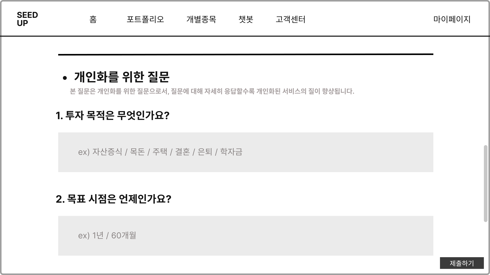

# 형식 참고

헤더 바는 이미지처럼 투자 성향 설문조사 부터 홈 포트폴리오 개별종목 챗봇 고객센터 마이페이지 고정이야
질문과 점수 계산은 이 pdf 그래도 할거야
[text](../../../../Downloads/코스콤_투자성향설문_21.08.pdf)
---

### 1) user 테이블에 “투자성향 결과”만 저장

* 설문 응답 원본은 저장하지 않는다.
* user 테이블에 아래 컬럼이 **없으면** 마이그레이션 없이도 동작 가능하도록 “컬럼 추가 SQL”을 제공하거나, 최소한 컬럼명이 이미 있다고 가정하고 update만 수행한다.
* 저장할 컬럼(권장):

  * `invest_total_score` (INTEGER)
  * `invest_base_type` (TEXT)
  * `invest_final_type` (TEXT)
  * `invest_updated_at` (DATETIME)

### 2) API

* `POST /survey/submit`

  * 로그인 사용자만 접근 가능 (Authorization Bearer)
  * Body로 투자성향 설문 응답(JSON)을 받는다.
  * 서버에서 점수 계산 후 `{total_score, base_type, final_type}`를 만든다.
  * 그리고 **현재 로그인한 user row**를 찾아서 아래처럼 업데이트한다:

    * `invest_total_score = total_score`
    * `invest_base_type = base_type`
    * `invest_final_type = final_type`
    * `invest_updated_at = now()`
  * response는 `{total_score, base_type, final_type}`만 반환한다.

### 3) 투자성향 점수 계산 규칙

* 1~10번 점수 합산, 총점 45점
* 3번(투자경험)은 복수선택 가능하지만 점수는 누적하지 않고 “최고점 1개만” 반영한다. 투자기간도 동일하게 최고점 1개만 반영한다.
* 총점으로 base_type:

  * 30+: 공격투자형
  * 25~29: 적극투자형
  * 20~24: 위험중립형
  * 15~19: 안전추구형
  * <=14: 안정형
* final_type은 투자예정기간(q9)과 base_type 조합으로 아래 매트릭스로 결정:

  * base=공격: {1:위험중립, 2:공격, 3:공격, 4:공격, 5:공격}
  * base=적극: {1:위험중립, 2:적극, 3:적극, 4:공격, 5:공격}
  * base=위험중립: {1:안전추구, 2:위험중립, 3:적극, 4:적극, 5:공격}
  * base=안전추구: {1:안전추구, 2:안전추구, 3:위험중립, 4:위험중립, 5:위험중립}
  * base=안정: {1:안정, 2:안전추구, 3:안전추구, 4:위험중립, 5:위험중립}
* 점수 매핑은 dict로 관리한다. (q9 점수는 1~5 → 1~5로 일단 둔다.)

### 4) 구현 디테일

* `scoring.py`에 `compute(answer)->(total, base, final)` 함수로 분리한다.
* 라우터에서 DB 세션을 주입받아 현재 user를 업데이트한다.
* 예외처리:

  * 토큰 invalid: 401
  * user_id로 user 못찾음: 404
  * validation error: 422

### 5) (선택) 컬럼이 없을 때 대비 SQL 제공

SQLite에서 user 테이블에 컬럼이 없으면 아래 SQL로 추가할 수 있게 한다:

* `ALTER TABLE user ADD COLUMN invest_total_score INTEGER;`
* `ALTER TABLE user ADD COLUMN invest_base_type TEXT;`
* `ALTER TABLE user ADD COLUMN invest_final_type TEXT;`
* `ALTER TABLE user ADD COLUMN invest_updated_at TEXT;`  (SQLite는 TEXT로 datetime 저장)

---

 
