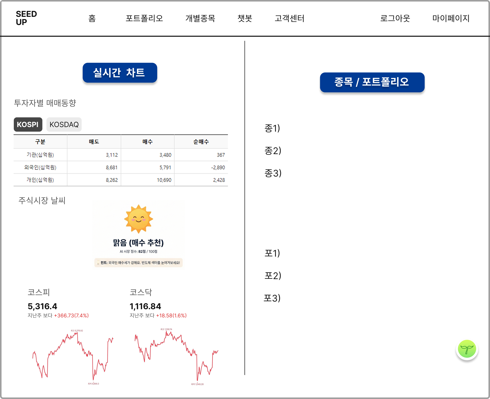

# 로그인 완료 후 넘어갈 대시보드 페이지 구현
아래 와이어프레임, 화면설계서와 나머지 내용들을 읽고 기능의 백엔드와 프론트엔드를 구현해줘.

## 와이어프레임



## 화면설계서
[페이지 이분할 중 좌측 화면]
1. 투자자별 매매동향 정보 수집해서 와이어프레임에서와 같이 표로 보여줄 것.
2. 투자자별 매매동향 정보를 토대로 주식시장의 날씨를 사용자에게 제공한다.
3. 코스피/코스닥
- 전일 종가 기준 코스피, 코스닥 지수 표시 및 차트 시각화
[페이지 이분할 중 우측 화면]
4. 페이지 우측 화면에 종목/ 포트폴리오
- '종목/포트폴리오' 버튼 누르면 종목/포트폴리오 추천 상세 페이지로 이동
5. 종목/포트폴리오 추천 목록
- 각각의 종목 및 포트폴리오 추천 리스트 표시
6. 플로팅 챗봇
- 챗봇 버튼 누르면 간단한 질의가 가능한 화면 표시


## 1. 투자자별 매매동향 정보 수집하는 방법
-  pykrx 라이브러리는 이미 가상환경에 설치한 상태야.
- 사용방법 예시
```
df_kospi = stock.get_market_trading_value_by_date(
    "20250101", "20250131", "KOSPI"
)
df_kosdaq = stock.get_market_trading_value_by_date(
    "20250101", "20250131", "KOSDAQ"
)

df_kospi["시장"] = "KOSPI"
df_kosdaq["시장"] = "KOSDAQ"

df_all = pd.concat([df_kospi, df_kosdaq])

print(df_all)

df_kosdaq = stock.get_market_trading_value_by_date(
    "20260201",
    "20260209",
    ticker="KOSDAQ",
    on="매수"
)
print(df_kosdaq.head())

df_kospi = stock.get_market_trading_value_by_date(
    fromdate="20260201",
    todate="20260209",
    ticker="KOSPI",
    on="매도"
)

print(df_kospi)
```

## 2. 주식시장 날씨
- 투자자별 매매 동향 정보를 토대로 llm이 분석해서 주식시장의 날씨를 알려주는 기능이야. 
- 투자자별 매매 동향에 따라 llm이 날씨를 어떻게 판단하면 좋을지 로직 알려줘.

    ### LLM 기반 시장 날씨 판별 로직
    LLM이 투자자별 매매 동향 데이터를 분석하여 '시장 점수'와 '날씨'를 도출하는 기준입니다.
    항목,가중치,판단 로직 (순매수 기준)
    외국인,45%,+값이 클수록 점수 대폭 가산 (시장 주도세력)
    기관,35%,"+값이 클수록 점수 가산 (금융투자, 연기금 등 수급 확인)"
    개인,10%,+값이 클 경우 오히려 점수 차감 (개인만 매수 시 하락장 신호로 해석)
    수급 강도,10%,전일 대비 거래 대금 및 순매수 폭의 변화량 반영

    ### [날씨 상태 정의] (AI Market Score: 0~100)
    - 맑음 (80점 이상): 외인/기관 동반 순매수. "적극 매수 및 보유 고려"
    - 구름조금 (60~79점): 외인 혹은 기관 중 한 주체만 집중 매수. "종목별 차별화 장세"
    - 흐림 (40~59점): 외인/기관 매도세, 개인 홀로 매수. "관망 및 보수적 접근"
    - 비/천둥 (40점 미만): 외인/기관 동반 투매. "리스크 관리 및 손절 고려"

    ### LLM용 시스템 프롬프트 (System Prompt)
    LLM 에이전트가 데이터를 수신했을 때 일관된 답변을 하도록 아래 프롬프트를 적용합니다.
    ```
    **Role**: 너는 대한민국 주식 시장 수급 분석 전문가이자 친절한 투자 가이드야.
    **Input**: JSON 형태의 투자자별 매매동향 데이터 (기관, 외국인, 개인의 순매수 대금)
    **Task**: 
    1. 수급 데이터를 바탕으로 '시장 점수(0~100)'를 산출해.
    2. 점수에 맞는 날씨 상태(맑음, 구름조금, 흐림, 비)를 결정해.
    3. 초보 투자자가 이해하기 쉬운 '오늘의 투자 힌트'를 한 줄로 요약해줘.
    **Output Format**:
    {
    "weather": "맑음",
    "recommendation": "매수 추천",
    "hint": "외국인 매수세가 강해요. 반도체 섹터를 눈여겨보세요!"
    }
    ```

    ### 데이터 가공 및 API 연동 가이드
    pykrx로 추출한 DataFrame을 to_dict() 또는 to_json()으로 변환하여 LLM의 Context로 전달.

    예시 데이터 구조 (LLM 전달용):
    ```
    {
    "market": "KOSPI",
    "data": {
        "institution": 3112,
        "foreign": -2890,
        "individual": 2428
    },
    "trend": "Foreigners are selling while individuals are buying."
    }
    ```

## 추가조언
- 데이터 단위 통일: pykrx는 기본적으로 '주' 단위나 '원' 단위를 사용하므로, LLM이 헷갈리지 않게 '억 원' 단위로 스케일링하여 전달하는 것이 토큰 절약과 분석 정확도 면에서 유리할 것 같음.
- 데이터 신뢰성 고지: 대시보드 하단에 "본 정보는 투자 판단의 참고 자료이며, 투자 결과에 대한 책임은 본인에게 있습니다."라는 **면책 조항(Disclaimer)**을 반드시 포함하도록 할 것.


