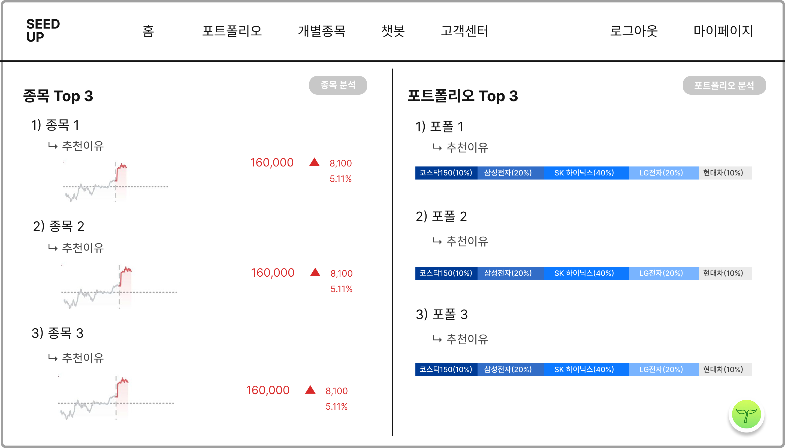
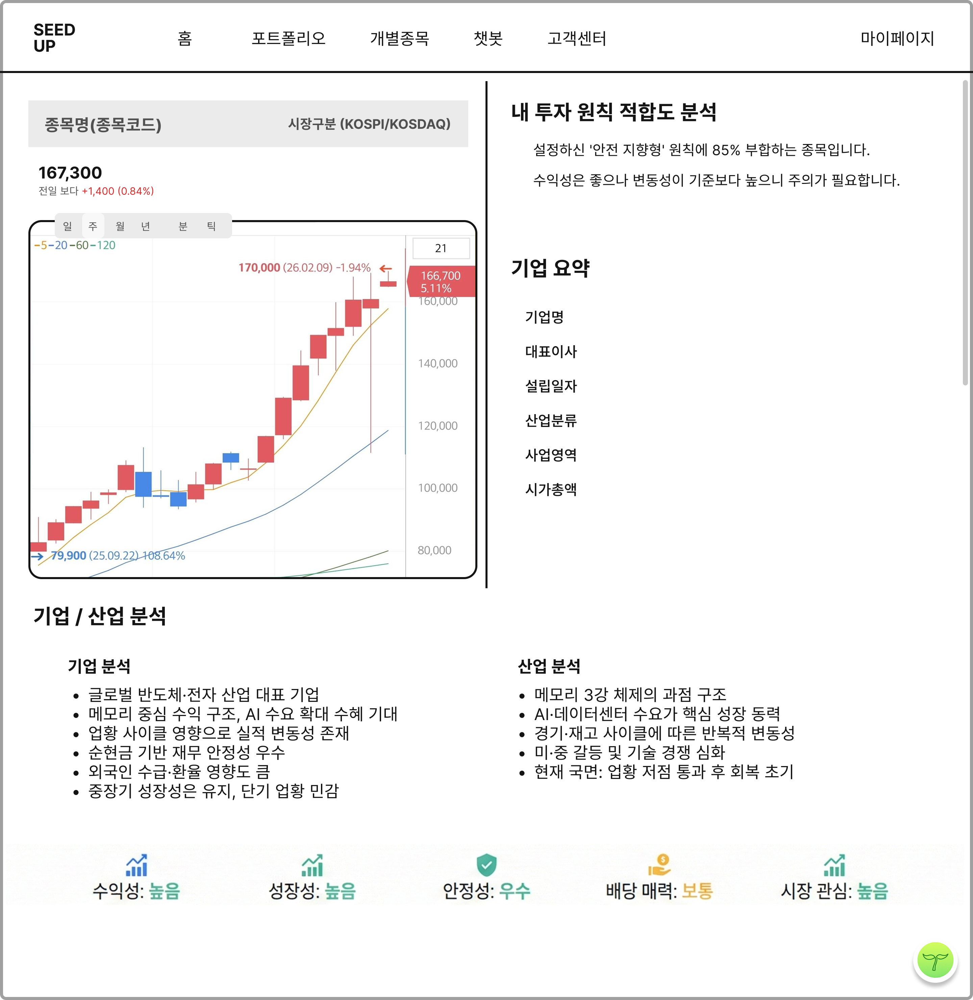
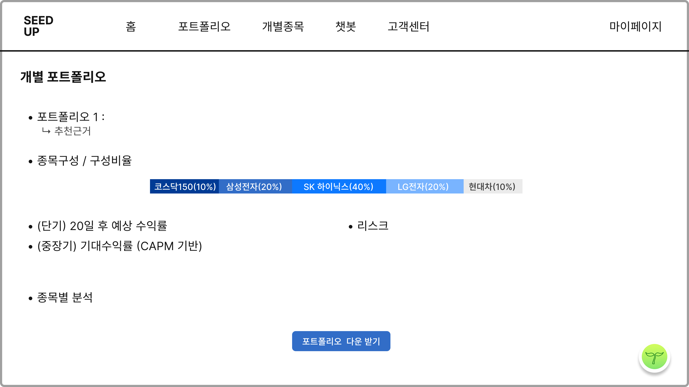
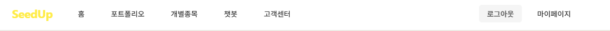

# 종목 및 포트폴리오 추천 상세 페이지 구현 요청사항

## 와이어프레임

## 화면설계서
1. 종목 Top3
- 종목 Top3 리스트 표시

2. 종목 명
- 각각의 종목과 추천 이유 생성 후 표시
- 종목 명 누르면 개별 종목 페이지로 이동

3. 종목 주가 차트
- 해당 종목의 차트 표시 후 현재 주가와 전일 종가 기준 오른 금액 및 퍼센티지 표시

4. 포트폴리오 Top3
- 포트폴리오 Top3 리스트 표시

5. 포트폴리오명
- 해당 포트폴리오의 비율과 추천이유 표시
- 각 포트폴리오를 누르면 개인 맞춤 상세 포트폴리오로 이동

데이터는 한국투자증권 API를 가져올 예정이야. 우선 더미 데이터를 입력해줘.

# 종목 TOP3(stockDetail page) 상세 페이지 구현 요청사항

## 와이어프레임

## 화면설계서
1. 종목명(종목코드) 표시 /시장구분 (KOSPI/KOSDAQ)

2. 현재 주가 / 전일 대비 등락률

3. 캔들 차트

4. 내 투자 원칙 적합도 분석 결과 제공
- 사용자의 투자 성향과 종목의 재무적/비재무적 지표를 대조하여 개인화된 적합성 리포트 제공

5. 기업 요약
- 기업명, 대표이사, 설립일자, 산업분류, 사업영역, 시가총액  등 기업의 기존 정보 요약 제공

6. 기업/산업 분석 
- 사용자의 가독성을 위해 개조식으로 설명 

7. 해당 기업의 종학 분석 시각화
- 수익성, 성장성, 안정성, 배당 매력, 시장 관심에 대한 종합 분석 시각화
- 해당 요소 클릭 시 팝업으로 지표 로직과 출처 명시

# 포트폴리오 TOP3 (PortfolioDetail Page) 상세 페이지 구현 요청사항 

## 와이어프레임

## 화면설계서
1. 포트폴리오명
- AI 생성 포트폴리오와 해당 종목 추천 근거 짧게 요약해서 표시

2. 종목구성/구성비율
- 해당 포트폴리오 구성 종목과 비율 바 타입으로 표시 (색상은 종목/포트폴리오 추천 페이지에서 사용한 그라데이션과 색상 이용 할 것)
- 종목 명 누르면 개별 종목 페이지로 이동

3. 수익률/리스크
- 단기/중장기 수익률 표시
- LLM으로 생성한 해당 포트폴리오가 지니고 있는 리스크 표시

4. 종목별 분석
- 각 종목을 넣은 이유 및 근거 표시

5. 포트폴리오 다운받기
- 포트폴리오 다운 받기를 누르면 해당 포트폴리오에 대한 세부적인 내용이 담긴 pdf 보고서 저장 가능하도록 구현

# 네비게이션 바 설정
- recommendationspage/stockDetail page/PortfolioDetail Page 세 페이지 모두 아래 이미지 처럼 구성해줘
 

